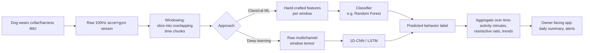

# KNOWLEDGE.md — Animal Activity Recognition from Wearable IMU Sensors

> This is a living document. As we learn more (from you, from the data, from experiments), we add to it. Don't skip sections just because they seem basic — the goal is that someone with zero background in this field could read this and follow the rest of the project.

---

## 1. What this domain is, and why it exists

This project sits at the intersection of two fields:

1. **Human Activity Recognition (HAR)**, adapted to animals — sometimes called **Animal Biologging** or **Animal Activity Recognition (AAR)**. The idea: strap motion sensors (accelerometer + gyroscope) to a body, record the raw motion signal, and train a model to infer *what the body was doing* (walking, running, lying down, shaking, etc.) purely from the shape of that signal.
2. **Wearable/embedded ML product design** — the practical constraints of turning a research-grade classifier into something that runs on battery-powered hardware a dog wears every day, and reports something a pet owner actually cares about.

**Why this field exists at all:** you can't ask a dog how much it exercised today, whether it's limping, or whether it's stressed. Direct observation doesn't scale (owners aren't watching 24/7) and self-report is impossible. But bodies move in physically distinct, repeatable patterns for different behaviors — a trot has a different acceleration signature than a gallop or a stretch. If you can capture that signal cheaply and classify it reliably, you get a continuous, objective window into an animal's behavior and wellness without any human watching.

This is the same underlying idea as a Fitbit/Apple Watch inferring "you were running" from wrist motion — just applied to a quadruped with a very different gait and sensor placement (collar/harness, not wrist).

---

## 2. Core concepts, terminology, and mental models

### 2.1 The sensors

| Term | Plain-language definition |
|---|---|
| **IMU (Inertial Measurement Unit)** | A small chip combining an accelerometer and gyroscope (sometimes a magnetometer too). It's the standard sensor package for motion sensing in wearables. |
| **Accelerometer** | Measures **acceleration** along 3 axes (x, y, z) — how fast velocity is changing, including gravity. When a sensor is still, it still reads ~1g on whichever axis points "down," because gravity is a constant acceleration. This is how you can infer orientation/tilt even without movement. |
| **Gyroscope** | Measures **angular velocity** (rate of rotation) along 3 axes — how fast the sensor is *turning*, not moving in a straight line. Good for detecting head-shakes, spins, and rotational components of gait that pure acceleration misses. |
| **Axes (x, y, z)** | Fixed relative to the sensor's own casing, not the world. This matters a lot: if the sensor twists on the collar, "z" no longer means the same physical direction it did before. This is a real source of noise (see Pitfalls). |
| **Sampling rate** | How many readings per second the sensor produces. In this dataset, timestamps step by 0.01s → **100 Hz**. Higher rate = finer-grained motion detail but more data/battery/compute cost. |

### 2.2 Sensor placement matters

This dataset has **two sensor locations per dog**: one on the **back** (`ABack`/`GBack`) and one on the **neck** (`ANeck`/`GNeck`). This isn't redundancy — it's deliberate:
- **Neck/collar sensors** are the easiest to productize (dogs already wear collars) but pick up a lot of head-specific motion (sniffing, looking around, shaking) mixed in with body motion — noisier signal for whole-body gait.
- **Back/harness sensors** sit closer to the animal's center of mass, giving a cleaner gait signal, but harnesses are less commonly worn day-to-day than collars.

> ASSUMPTION: Since the product target is a consumer collar-based wearable, the eventual production model will likely need to work from **neck-only** data (no harness), even though this training dataset gives you both. Treat the back sensor as a "gold-standard" reference signal during development, not something the shipped product can rely on. Flag this if wrong.

### 2.3 The labels (ground truth)

| Term | Plain-language definition |
|---|---|
| **Behavior** | The activity label for a given moment (e.g., Walking, Trotting, Galloping, Standing, Sitting, Lying chest, Shaking, Sniffing). This is the thing your model predicts. |
| **Task** | A higher-level session/context label in this dataset (e.g., what activity block the recording session was structured around) — coarser than Behavior. |
| **PointEvent** | A label for a discrete, instantaneous event (like a single shake or jump) rather than a sustained state — these are point-in-time annotations layered on top of the continuous behavior stream. |
| **Ground truth via video annotation** | Datasets like this are built by video-recording the dog while it wears sensors, then having a human annotator watch the video and label each time segment with the behavior seen. This is the standard (and expensive/slow) way to get labeled training data in this field — it's why public labeled datasets like this one are valuable and rare. |

### 2.4 Core ML mental model: this is Time-Series Classification

Unlike classifying a single static image, here the **unit of input is a window of time**, not a single row. A single 100Hz reading tells you almost nothing (it's a snapshot of instantaneous acceleration); the *pattern over ~1-3 seconds* is what encodes "this is a trot."

```
Raw stream:  ...row, row, row, row, row, row, row, row, row...  (100 rows/sec)
                     └──────────── window (e.g. 1.5s = 150 rows) ────────────┘
                                          │
                                   feature extraction
                                     or raw-to-model
                                          │
                                     [ "Trotting" ]
```

Two broad approaches:
1. **Feature-based (classical ML)**: slide a fixed-size window over the signal, compute hand-crafted statistical features per window (mean, std, min/max, signal magnitude area, dominant frequency via FFT, jerk, etc.), then feed those features into a classical classifier (Random Forest, XGBoost, SVM). This is the traditional HAR approach — cheap, interpretable, and works well even with modest data.
2. **Deep learning (raw signal)**: feed the raw windowed multi-channel signal directly into a 1D-CNN, LSTM/GRU, or a small Transformer, letting the model learn its own features. Needs more data and compute but can capture subtler patterns and skips manual feature engineering.

> For an on-device wearable/phone-app target, **feature-based classical ML is usually the pragmatic starting point** — it's orders of magnitude cheaper to run and easier to shrink to fit mobile/embedded constraints. Deep learning becomes attractive later if accuracy plateaus and you're willing to invest in quantization/TinyML tooling. (See §6, TensorFlow Lite / Edge Impulse.)

### 2.5 Windowing details you'll need

| Term | Plain-language definition |
|---|---|
| **Window size** | How many seconds/samples go into one classification decision. Too short → not enough signal to distinguish similar gaits. Too long → mixes two different behaviors together, blurs transitions, adds latency. |
| **Overlap / stride** | Windows are usually overlapped (e.g., 50%) to get more training examples and smoother/more responsive predictions, rather than sliding by exactly one window length each time. |
| **Class imbalance** | Real-world behavior data is wildly imbalanced — a dog lies down or stands far more than it gallops. Models trained naively will get lazy and just predict the majority class. This dataset will very likely show this pattern; expect to need techniques like class weighting, oversampling of rare classes, or resampling. |
| **Sensor drift / calibration** | Sensors can have small persistent biases (a "resting" gyroscope reading that isn't quite 0) that vary between devices. A model trained on one sensor's data can degrade on another physical unit unless this is handled (normalization, per-session baseline calibration). |

---

## 3. How the pieces fit together



**Analogy:** think of this like Shazam for movement instead of sound. Shazam doesn't recognize a whole song from one sample — it needs a short window of audio, extracts a fingerprint (features), and matches it against known patterns. Here, a window of IMU data is the "audio clip," the extracted statistics are the "fingerprint," and the trained classifier is the "song database" — except instead of a song title, it returns "Trotting."

---

## 4. Prerequisites you should understand first

If any of these are unfamiliar, it's worth a quick primer before going deeper into modeling:

1. **Basic signal processing intuition**: what a time series is, what "noise" vs "signal" means, and what a moving average / low-pass filter does (used to smooth raw sensor noise before feature extraction).
2. **Supervised classification basics**: train/test split, what a confusion matrix tells you, precision/recall (especially important here because of class imbalance — accuracy alone will lie to you).
3. **Cross-validation by subject, not by row**: in this dataset each `DogID` contributes many rows. If you randomly split rows into train/test, the model can "cheat" by learning that specific dog's gait quirks rather than general behavior patterns, and your test accuracy will look great but generalize terribly to a new dog. You almost always want **leave-one-dog-out** or **group k-fold by DogID** validation here. This is one of the most common and costly mistakes in this field.
4. **What "on-device inference" implies**: model size limits, no internet dependency, battery/CPU budget, and the toolchains used to convert a trained model (e.g., scikit-learn or PyTorch) into a mobile-runnable format (TFLite, Core ML, ONNX Runtime Mobile).

---

## 5. Common pitfalls, misconceptions, and gotchas

- **"More sensors = always better."** Not for a shipped product — every extra sensor location is a harness/strap the owner has to put on the dog correctly, every day. Consumer wearables win on simplicity. Optimize for collar-only if that's the real target, even if it costs some accuracy versus using the back sensor too.
- **Row-level train/test split leaks subject identity.** Covered above — always validate by holding out entire dogs, not shuffled rows.
- **Treating accuracy as the metric.** With imbalanced classes (lots of "Standing," little "Galloping"), a model that always predicts the majority class can hit 70-80% "accuracy" while being useless. Use per-class precision/recall/F1 and a confusion matrix instead.
- **Ignoring breed/size variation.** Gait signatures differ substantially by dog size/breed/leg length. A model trained on this dataset's specific dogs (`DogID`s) may not generalize to a Chihuahua if the training set was mostly larger breeds — check what breeds/sizes are actually represented before promising broad applicability.
- **Sensor axis orientation isn't guaranteed consistent.** A collar can rotate around the neck as the dog moves; "x" doesn't always mean the same physical direction reading to reading. Features that are **orientation-invariant** (like total acceleration magnitude `sqrt(x²+y²+z²)`) are often more robust than raw per-axis values for this reason.
- **Confusing `Behavior_1/2/3` layering with independent labels.** Multiple behavior columns plus a separate `PointEvent` column suggest **hierarchical or overlapping annotation** (e.g., a sustained behavior label plus a simultaneous discrete event). Don't assume they're mutually exclusive alternatives — this needs to be verified empirically against the data before deciding how to encode the target label (see open question in PROJECT.md).
- **Silent gaps or resampling issues.** Real-world sensor logs often have dropped samples or timestamp jitter. Verify `t_sec` actually increments consistently at 100Hz throughout, rather than assuming it from the first few rows.
- **Lab data ≠ field data.** This dataset was likely collected in a controlled/observed setting for clean video-annotated labels. Real dogs in real homes move very differently (interrupted, ambiguous, mixed behaviors) — expect a real-world accuracy drop versus validation-set numbers, and don't over-promise based on lab benchmarks alone.

---

## 6. Current state of the art & key tools

**Research context:** This dataset is drawn from published animal-activity-recognition research (Vehkaoja et al. and related work on dog accelerometer/gyroscope behavior classification) — a well-studied academic niche, distinct from but methodologically identical to human HAR research (e.g., the long-running UCI HAR / WISDM datasets for humans).

**Libraries/tools relevant to this project:**

| Purpose | Tool |
|---|---|
| Data wrangling / feature engineering | `pandas`, `numpy`, `scipy.signal` (filtering) |
| Classical ML | `scikit-learn` (RandomForest, SVM, gradient boosting), `xgboost`/`lightgbm` |
| Time-series feature extraction (automated) | `tsfresh`, `tsfel` — libraries that auto-generate hundreds of standard time-series features per window so you don't hand-write them all |
| Deep learning (if needed later) | `PyTorch` or `TensorFlow/Keras` for 1D-CNN/LSTM architectures |
| On-device / mobile deployment | **TensorFlow Lite** (Android + iOS via Core ML conversion path), **Core ML** (native iOS), **ONNX Runtime Mobile** (cross-platform) — converts a trained model into a small, fast mobile-runnable format |
| Embedded/TinyML (if targeting the collar hardware itself later, not just phone) | **Edge Impulse** (widely used for exactly this: wearable IMU → gesture/activity classification → deployed to microcontrollers), TensorFlow Lite Micro |
| BLE sensor streaming prototyping | React Native / Flutter BLE libraries, or Nordic's nRF Connect tooling if you get real hardware |

**Key papers/references to be aware of** (verify current links before citing in anything external-facing):
- Vehkaoja, A. et al., work on dog activity/behavior recognition using back/neck-mounted accelerometers — the likely origin of this exact dataset structure (ABack/ANeck/GBack/GNeck naming convention).
- General HAR survey literature (e.g., "A Survey on Human Activity Recognition using Wearable Sensors") — the human-side methodology transfers almost directly.

---

## 7. Further reading

> ASSUMPTION: I have not fetched live URLs for this section — the topics below are well-established and stable, but exact links should be verified before relying on them, since I can't browse the web in this environment right now.

- **scikit-learn docs** on classification metrics (precision/recall/F1, confusion matrix) — essential before evaluating any model here.
- **`tsfresh` documentation** — for automated time-series feature extraction, directly applicable to windowed IMU data.
- **TensorFlow Lite "Convert your model" guide** — the concrete path from a trained model to something a phone app can run on-device.
- **Edge Impulse's public tutorials on wearable/IMU gesture & activity recognition** — closest existing worked example to this exact project shape (IMU → embedded classifier).
- Search terms to use when you want to go deeper: *"human activity recognition wearable accelerometer survey"*, *"animal biologging accelerometer behavior classification"*, *"leave-one-subject-out cross validation HAR"*, *"TinyML gesture recognition IMU"*.

---

## 8. What we've confirmed from the actual data file

A full scan of `DogMoveData.csv` (10,611,068 rows, ~1.98 GB, 100 Hz) confirms:

- **45 distinct dogs** (`DogID` values: 16, 18, 19, 20, 21, 22, 23, 25, 26, 27, 28, 29, 30, 33, 34, 36, 39, 41, 43, 44, 45, 46, 47, 48, 49, 51, 52, 53, 54, 55, 56, 57, 58, 59, 60, 61, 63, 65, 66, 67, 68, 70, 72, 73, 74). This is a solid number of subjects for leave-one-dog-out validation.
- **8 `Task` values**: `<undefined>`, `Task walk`, `Task sit`, `Task trot`, `Task lie down`, `Task play`, `Task stand`, `Task treat-search`. This confirms `Task` is the **structured protocol/session label** — it tells you what the handler asked the dog to do during that recording block. It is a coarser, experimenter-controlled label, distinct from the moment-to-moment observed `Behavior_1`.
- **19 raw `Behavior_1` values** (plus `<undefined>` for unlabeled rows): `Synchronization`, `Walking`, `Shaking`, `Sniffing`, `Eating`, `Sitting`, `Trotting`, `Pacing`, `Lying chest`, `Playing`, `Standing`, `Panting`, `Drinking`, `Galloping`, `Carrying object`, `Extra_Synchronization`, `Tugging`, `Jumping`, `Bowing`.
  - `Synchronization` / `Extra_Synchronization` are **not real behaviors** — they're clock-alignment markers used to sync the sensor stream with the video annotation timeline. These rows are **excluded from training** (16,755 + 287 rows respectively).
  - `<undefined>` rows (4,037,199 of 10,611,068 — ~38%) are unlabeled/unannotated time — also excluded from supervised training.
  - That leaves **17 real sustained behaviors** — see the full row-count table in §8 below — spanning posture (Standing, Sitting, Lying chest), locomotion/gait (Walking, Trotting, Pacing, Galloping), and discrete/short actions (Shaking, Jumping, Bowing, Drinking, Eating, Panting, Sniffing, Playing, Carrying object, Tugging).
  - Separately, the `PointEvent` column carries exactly **one** real discrete event type: `Bark` (26,173 occurrences; everything else is `<undefined>`).
  - **Total distinct real recorded actions in this dataset: 17 sustained behaviors + 1 point event (Bark) = 18.**

This directly resolves the open question about `Behavior_1` vs `Task`: **`Task` is what the dog was instructed/expected to do; `Behavior_1` is what was actually observed.** They will correlate strongly but not perfectly (e.g., during "Task walk" a dog might briefly sniff or stand). For a wellness-tracking product, `Behavior_1` is the ground truth you want to predict from sensor data — `Task` is protocol metadata from data collection, not something a real-world deployment would ever have available, so **it must not be used as a model input feature**, only (optionally) for sanity-checking labels during data cleaning.

**Full row counts per real `Behavior_1` value** (confirms severe class imbalance — plan for it, don't discover it late):

| Behavior | Rows | Coarse group (v0.1) |
|---|---:|---|
| Lying chest | 1,031,301 | Resting |
| Sniffing | 1,026,178 | Other |
| Playing | 862,571 | Active |
| Panting | 836,062 | Resting *(moved from Other — see note below the table)* |
| Walking | 728,930 | Active |
| Trotting | 717,593 | Active |
| Sitting | 509,412 | Resting |
| Standing | 448,691 | Resting |
| Eating | 166,210 | Other |
| Pacing | 77,104 | Active |
| Drinking | 64,721 | Other |
| Shaking | 41,234 | Other |
| Carrying object | 17,951 | Other |
| Tugging | 13,664 | Active |
| Galloping | 10,828 | Active |
| Jumping | 3,859 | Active |
| Bowing | 518 | Other |

The rarest classes (Bowing, Jumping, Galloping, Tugging) have 500-14,000 rows out of 6.56M labeled rows total — under 0.2% each. Any per-class metric for these will have wide uncertainty; don't over-trust a single accuracy number for them without also checking the raw support count.

> **Why Panting moved from Other to Resting:** the first trained coarse model's confusion matrix showed roughly half of all true Panting windows predicted as Standing/Sitting/Lying chest, and a comparable flow the other way — because a panting dog is, from the neck sensor's point of view, just a still dog whose chest happens to be heaving (a signal a neck-mounted IMU barely picks up). Trying to force Panting into a category the sensor can't actually distinguish from Resting was hurting **both** classes' accuracy. Moving it fixed the coarse model's single biggest error source — see the real before/after numbers in [PROJECT.md](PROJECT.md#v01-results-leave-one-dog-out-all-45-dogs-119826-windows).

**`Behavior_2` and `Behavior_3` are not new behavior categories** — scanning their values shows they draw from the *same* 17-item vocabulary as `Behavior_1` (e.g., `Sitting` + `Panting` simultaneously, or `Trotting` + `Galloping` + `Tugging` layered together). This confirms the annotation scheme is **multi-label/concurrent**: a dog can be doing a primary behavior (`Behavior_1`) while simultaneously doing up to two secondary things (`Behavior_2`, `Behavior_3`) — e.g., Sitting-while-Panting, or Trotting-while-Tugging(-on-a-leash). For v0.1 we predict `Behavior_1` only (the dominant/primary behavior) and treat `Behavior_2`/`Behavior_3` as a richer future signal, not part of the initial target.

## 9. BMI270 compatibility — does this training data transfer to real hardware?

The **BMI270** (Bosch Sensortec) is a 6-axis IMU — a 3-axis accelerometer + 3-axis gyroscope on one chip, widely used in wearables (it's the class of sensor found in devices like fitness trackers). It's a sound hardware choice for this product: low power, small package, good for a battery-powered collar.

What matters for model transfer is **matching units and sample rate** between training data and live sensor output:

| Property | This dataset | BMI270 | Compatibility |
|---|---|---|---|
| Accelerometer unit | g (values cluster around ±1-2 at rest/moderate motion — consistent with gravity-referenced g, not raw ADC counts or m/s²) | Configurable range: ±2g / ±4g / ±8g / ±16g, output as raw 16-bit counts that must be scaled to g using the configured range's sensitivity | Compatible, **if** firmware converts raw counts to g using the correct sensitivity before feeding the model. Recommend ±8g range to comfortably cover galloping/jumping impact spikes without clipping. |
| Gyroscope unit | deg/s (values range roughly ±20 to ±40+ during active motion) | Configurable range: ±125 to ±2000 deg/s, also raw counts needing sensitivity scaling | Compatible with the same caveat — convert to deg/s, don't feed raw counts to the model. Recommend ±500 deg/s or ±1000 deg/s range as a starting point; revisit if galloping/shaking clips it. |
| Sample rate | Fixed 100 Hz (`t_sec` steps by exactly 0.01) | Configurable output data rate (ODR), commonly up to 1600Hz+, but low-power wearable use typically runs much lower (25-100Hz) to save battery | **Must explicitly configure BMI270 ODR to 100Hz** (or resample to 100Hz in firmware/app) to match what the model's feature windows expect. A mismatched rate changes the number of samples per 1-second window and will silently corrupt every windowed feature (mean/std are fine, but FFT-based dominant-frequency and zero-crossing features are sample-rate dependent). |
| Sensor placement | Collar/neck-mounted (this project trains a **neck-only** model — see PROJECT.md decision log) | Wherever the physical collar module sits on the neck | Compatible in principle, but **orientation on the neck must be consistent enough** across fastenings that "up/down/forward" roughly means the same thing session to session — or the model must rely on orientation-invariant features (magnitude, not raw x/y/z) to stay robust to collar rotation/slippage. This project's feature set already includes per-axis magnitude for this reason. |

> ASSUMPTION: I'm inferring the dataset's accelerometer unit is g (not m/s² or raw counts) from the value ranges in the raw CSV (e.g., resting values near 1.0 on one axis, consistent with gravity). This is very likely correct but hasn't been cross-checked against an official data dictionary for this dataset — verify if one surfaces.

**Practical implication for the app:** the BMI270 driver/firmware layer must produce g-scaled accelerometer values and deg/s-scaled gyroscope values at a fixed 100Hz, in the same six channels used here (`ANeck_x/y/z`, `GNeck_x/y/z`) before calling the model's feature-extraction code. Getting this calibration/scaling step right is one of the most common places a "works on the training CSV" model quietly breaks in the field — test it explicitly with a real BMI270 unit early, don't assume it from the datasheet alone.

## 10. Detecting *abnormal* movement vs. detecting *disease*

This is worth being very precise about, because it's easy to conflate two very different capabilities:

- **Abnormal-movement detection** (statistically unusual motion for a given dog, or unusual gait regularity) — this **can** be built from this dataset, because the dataset gives us a rich picture of what *normal* movement looks like across 45 dogs and 17 behaviors. An anomaly detector (e.g., Isolation Forest on a personal per-dog baseline) or a signal-processing heuristic (e.g., gait-cycle regularity via spectral purity of the dominant stride frequency) is a legitimate, buildable feature.
- **Disease detection** (e.g., "this dog has rabies," "this dog has arthritis") — this **cannot** be built from this dataset, because the dataset contains **zero** disease/illness/injury labels. There is no supervised signal connecting any row of sensor data to any diagnosed condition. A model can only learn associations that exist in its training labels; asking it to output a disease name from data that never included disease labels would mean the model is guessing, not detecting — indistinguishable from noise, but presented with false confidence.

The responsible design (see [PROJECT.md](PROJECT.md) decision log) is a two-layer separation:
1. **Model layer**: outputs only behavior labels and mechanically-described anomaly flags ("gait less regular than usual," "more shaking-type motion than usual for this dog") — never a diagnosis.
2. **Content layer**: a static, non-personalized educational panel (see [content/health_education.md](content/health_education.md)) that explains, in general terms, what kinds of conditions *can* involve gait or repetitive-motion changes — shown only as reference material after a flag, never as an inference about the specific dog, and with explicit emergency-contact guidance for anything rabies-adjacent (behavioral change + incoordination + possible exposure), since that specific condition carries public-health urgency that a routine "monitor and see" framing would badly undersell.

**Gait-regularity as a concept**, since it's not covered above: a healthy, steady gait (walking/trotting/galloping) produces a very periodic signal — each stride looks like the last, so almost all of the movement's energy concentrates at one dominant frequency (the stride rate) when you look at its frequency spectrum (via FFT). An irregular, asymmetric, or compensating gait (of the kind associated with pain or injury in general veterinary/biomechanics literature) tends to spread that energy across multiple frequencies instead of one clean peak, because each stride no longer matches the last. Measuring what fraction of total spectral energy sits in the single strongest frequency bin (this project calls it **spectral purity**) gives a simple, defensible, computable proxy for gait regularity — without needing a single labeled "limping" example to compute it. It is still a proxy, not a validated clinical measure; treat any flag it raises as "worth a second look," not as evidence of a specific injury.

> **Calibration lesson learned while building this** (worth keeping as a general pattern for any unvalidated heuristic): the first version of this heuristic used a fixed absolute spectral-purity cutoff (0.35) picked by eyeballing the formula, with no ground truth to check it against. Run against the real 45-dog dataset, it flagged **94% of all locomotion windows** — obviously wrong, since that would mean almost every dog's normal gait looks "irregular." The actual cause was a measurement artifact: a 1-second window only captures 1-3 stride cycles, and without a windowing taper, a plain FFT leaks even a perfectly periodic signal's energy across neighboring frequency bins, making spectral purity look low regardless of true gait regularity. The fix ([scripts/anomaly_detection.py](scripts/anomaly_detection.py)): apply a Hann taper before the FFT to reduce leakage, and flag by **percentile within the observed data** (bottom 10% of locomotion windows) instead of a hand-picked absolute number, since there's no external ground truth to justify any specific absolute threshold. The general lesson: when you have no labeled ground truth for a heuristic, sanity-check its flagged rate against what you'd naively expect *before* trusting or shipping it — an absolute threshold picked without calibration data is a guess, and guesses on health-adjacent features can look authoritative while being silently wrong.

### Anomaly detectors can have a blind side — direction of deviation matters, not just distance

A follow-up synthetic sanity test ([PROJECT.md production-hardening item 9](PROJECT.md)) surfaced a subtler and more important lesson than the calibration bug above. IMPORTANT CAVEAT up front: this test corrupts real Walking/Trotting windows synthetically (reduced stride regularity, amplitude compression, single-axis noise) — it is **not** real pathology, no veterinary professional reviewed these corruptions as realistic proxies for actual limping or illness, and passing/failing it says something about the detector's mechanics, not about real-world diagnostic validity.

With that caveat firmly in place, the finding: pushing the corruption severity up in stages showed that **gait-irregularity detection genuinely works** (49.5% flagged at severe stride disruption vs. a 5.5% baseline — a real, graded response to a real signal), but **amplitude/range compression is a confirmed structural blind spot, at every severity tested, including a very extreme 90% amplitude reduction (0% flagged, unchanged from baseline at both mild and severe)**. The mechanism is worth understanding generally, because it applies to any "distance from personal baseline" anomaly detector, not just this one: compressing a signal toward its own mean literally moves its derived statistics (standard deviation, RMS, range) *closer to* that mean — which is exactly what "looks typical" means to a detector built around statistical distance from a center point. A dog moving *less* than usual doesn't look far from center; it looks unusually close to center. **The lesson: an outlier detector built on "distance from normal" has no inherent way to distinguish "unusually intense" from "unusually suppressed" — it will reliably catch the former and just as reliably miss the latter, because both can't be "far from center" in the same sense.** This matters a lot here specifically because reduced activity, restricted range of motion, and lethargy are among the most common real-world signs of pain, illness, or fatigue in animals — arguably more clinically relevant day-to-day than hyperactivity — so a detector that's structurally blind to "less than usual" has a real gap on exactly the kind of signal that matters most. The fix isn't a better outlier detector; it's adding an explicit, separate, *directional* signal (e.g., "this dog's typical activity/RMS has dropped meaningfully below its own baseline over the last N days") that doesn't rely on two-sided statistical distance at all.

## Open questions / gaps to fill as we learn more

- [x] Exact relationship between `Behavior_1`, `Behavior_2`, `Behavior_3`, and `PointEvent` — confirmed (§8): `Behavior_2`/`Behavior_3` are concurrent secondary behaviors from the same 17-item vocabulary; `PointEvent` has exactly one real value (`Bark`).
- [ ] What breeds/sizes of dog are represented (affects generalization claims) — not encoded in this CSV; would need an accompanying metadata file if one exists, or must be treated as unknown.
- [x] Whether `Task` correlates with indoor/outdoor or a structured protocol — confirmed: `Task` is the experimenter-assigned protocol label (walk/sit/trot/lie down/play/stand/treat-search), not usable as a real-world input feature.
- [x] Class balance across the 17 real behavior classes — confirmed (§8 table): ranges from 1,031,301 rows (Lying chest) down to 518 rows (Bowing). Severe imbalance is real, not hypothetical.
- [x] Actual trained-model accuracy numbers (leave-one-dog-out, neck-only vs. neck+back, coarse vs. fine-grained) - done, see [PROJECT.md](PROJECT.md). The original 1-second neck-only coarse model reached 95.58%; a controlled 1-5 second LightGBM sweep reached **98.92% accuracy / 98.80% macro F1 at 5 seconds**. This higher score applies to stable, 80%-pure five-second windows and comes with more latency and fewer accepted transition windows. The 17-class fine model remains data-limited for Bowing, Jumping, Galloping, and Tugging.
- [ ] Veterinary review of [content/health_education.md](content/health_education.md) — currently drafted from general public knowledge, not clinical/veterinary authorship.
- [ ] Dedicated "reduced activity / restricted range of motion" anomaly signal — confirmed needed (see the anomaly blind-spot finding above), not yet built. Would track each dog's own baseline activity/RMS level and flag a meaningful *drop*, rather than relying on the existing IsolationForest, which is structurally unable to catch this direction of deviation.
