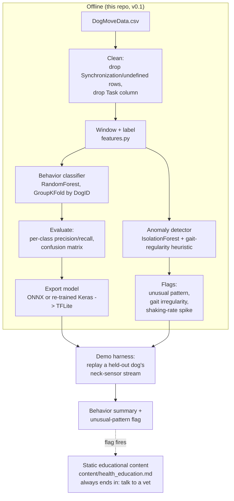

# PROJECT.md — MotionSense: Dog Activity & Wellness Tracking

> Living doc. Every design decision gets logged here with a one-line reason as we make it. See [KNOWLEDGE.md](KNOWLEDGE.md) for the domain background behind these choices.

---

## One-line description

A collar-worn IMU sensor + companion phone app that classifies a dog's behavior in real time (via on-device ML) to give owners a daily activity and wellness summary — like a Fitbit for dogs.

**Core problem it solves:** owners can't watch their dog 24/7, so they have no objective, continuous signal for "is my dog getting enough exercise / behaving normally / possibly unwell," beyond occasional vet visits and subjective impressions.

---

## Target user & primary use case

- **Target user:** everyday pet owners, not vets or professional trainers (v0.1 scope — see [KNOWLEDGE.md §2.2](KNOWLEDGE.md)).
- **Primary use case:** the owner glances at an app and sees "your dog was active for 47 minutes today, mostly walking/trotting, with 2 play sessions" — a passive wellness/activity summary, plus a secondary **unusual-movement flag** (not a diagnosis) when a dog's motion pattern deviates from its own normal baseline.
- **Explicit non-goal, permanently (not just v0.1):** diagnosing any specific disease or condition — including rabies — from sensor data. `DogMoveData.csv` contains zero disease-labeled examples, so no model trained on it can legitimately output a disease name; see [KNOWLEDGE.md §10](KNOWLEDGE.md) and the decision log below. What the app *can* responsibly do is flag "this looks unusual for your dog" and point to general educational content ([content/health_education.md](content/health_education.md)) that always ends in "talk to a vet."

---

## MVP scope (v0.1)

**In scope:**
- Train a behavior classifier on the existing `DogMoveData.csv` dataset, using **neck-sensor data only** (`ANeck_x/y/z`, `GNeck_x/y/z`, matching **BMI270** accelerometer+gyroscope output) — see decision log below for why.
- Collapse the **17 real behavior labels** (KNOWLEDGE.md §8) into a small set of owner-meaningful categories for v0.1: **Active** (Walking, Trotting, Pacing, Galloping, Playing, Jumping, Tugging), **Resting** (Standing, Sitting, Lying chest, **Panting**), **Other** (Shaking, Sniffing, Eating, Drinking, Bowing, Carrying object). Panting was moved into Resting after confusion-matrix analysis showed the two were IMU-indistinguishable — see decision log. A fine-grained 17-class model is also trained and evaluated alongside the coarse one (not deferred — see [scripts/train_behavior_model.py](scripts/train_behavior_model.py)), since it's needed as an input to the anomaly layer below.
- Offline model training pipeline (Python): load → clean → window → feature-extract → train → evaluate, validated **leave-one-dog-out** (`GroupKFold` by `DogID`). Implemented in [scripts/train_behavior_model.py](scripts/train_behavior_model.py) + [scripts/features.py](scripts/features.py).
- **Unusual-movement (anomaly) detection layer**, implemented in [scripts/anomaly_detection.py](scripts/anomaly_detection.py): per-dog-normalized IsolationForest over the same neck-sensor features, plus a gait-regularity heuristic (spectral purity of stride frequency) for locomotion windows, plus a personal-baseline-relative "Shaking rate" tracker. Outputs mechanical flags only (e.g., "gait less regular than usual") — never a disease name.
- Static, non-personalized educational content ([content/health_education.md](content/health_education.md)) shown when a flag fires — general information on conditions that can involve gait/repetitive-motion changes, with explicit non-diagnostic disclaimers and emergency-contact guidance for the rabies-adjacent tier.
- Export the trained model to a mobile-runnable format as a proof of concept for on-device inference — does not require a real collar or real BLE hardware yet (see tech-stack correction below re: TFLite vs. ONNX for tree ensembles).
- A minimal demo harness that feeds a held-out dog's recorded session through the exported model and shows predicted behavior + any anomaly flags over time, to prove the on-device path works end-to-end.

**Explicitly out of scope for v0.1:**
- Real hardware/collar firmware — this dataset stands in for the wearable until real BMI270 hardware is sourced and wired up.
- Live BLE streaming from a physical device.
- A polished consumer app UI (auth, onboarding, multi-dog support, notifications).
- **Naming any specific disease or condition as a model output** — permanently out of scope, not just v0.1 (see Target user & primary use case, above).
- Cloud sync, multi-device, or social/sharing features.
- Support for breeds/sizes not represented in the training data (unknown — see Risks).

---

## Tech stack

| Layer | Choice | One-line justification |
|---|---|---|
| Data processing / training | Python, `pandas` + `numpy` | Standard, fast to iterate, matches the CSV format directly. |
| Feature extraction | Hand-rolled vectorized numpy (mean/std/min/max/rms/zero-crossing-rate/dominant-FFT-frequency+power per channel) | `tsfresh` was the original plan but is row-by-row Python and far too slow at 10.6M rows / ~100k+ windows; a vectorized numpy pass over stacked window arrays does the same job orders of magnitude faster. **Correction to the earlier tsfresh choice, logged below.** |
| Sensor hardware target | **BMI270** (Bosch 6-axis accel+gyro) | User-specified; a real, common low-power wearable IMU. Dataset units (g, deg/s @ 100Hz) are compatible with BMI270 output once its ODR/range are configured to match — see [KNOWLEDGE.md §9](KNOWLEDGE.md). |
| Behavior classifier | **LightGBM** (`class_weight="balanced"`) — switched from RandomForest | Ties RandomForest on coarse accuracy (95.60% vs 95.58%) and beats it on fine-grained (67.3% vs 66.0%), while converting cleanly to ONNX for on-device export — see production-hardening item 4. RandomForest was the original v0.1 choice for the same "cheap, debuggable, exportable" reasons; LightGBM keeps those properties and resolves the export-format question at the same time. |
| Anomaly detector | `scikit-learn` IsolationForest over per-dog z-scored features + a spectral-purity gait heuristic | Needs no labeled abnormal data (none exists in this dataset) — learns "normal for this dog" and flags deviation, which is the only honest framing available ([KNOWLEDGE.md §10](KNOWLEDGE.md)). |
| Validation strategy | Leave-one-dog-out via `GroupKFold` (group = `DogID`), 5 folds | Prevents the model from memorizing individual dogs' gait quirks instead of learning general behavior patterns ([KNOWLEDGE.md §4](KNOWLEDGE.md)). |
| On-device export | **ONNX Runtime Mobile**, LightGBM exported via `onnxmltools` | Originally planned as TensorFlow Lite; tree ensembles (RandomForest/IsolationForest) don't convert to TFLite as cleanly as a native Keras model does. **Implemented and verified (milestone 6):** both production models (coarse 3-class, active-only fine 7-class) converted to ONNX with 100% label agreement vs. the native model on a 5,000-window sample. The anomaly layer's IsolationForest still needs its own export-path decision separately — sklearn's ONNX support for IsolationForest is less mature than for LightGBM. |
| Demo/companion app shell | Deferred — pick once the model proves out | No point committing to Flutter vs React Native vs native before we know the model is even viable; avoids wasted app-shell work if v0.1 modeling reveals accuracy problems. |

> ASSUMPTION: starting with classical ML (not deep learning) for the first model. This is the standard, lower-risk starting point for this problem size and target (see KNOWLEDGE.md §2.4) — flag if you want to skip straight to a CNN/LSTM approach instead.

> **Tech-stack correction (2026-08-22):** the original plan named TensorFlow Lite for on-device export, but a `scikit-learn` RandomForest doesn't convert into TFLite the way a native TensorFlow/Keras model does — the standard paths are (a) export via **ONNX** (`skl2onnx`) and run with **ONNX Runtime Mobile**, which supports tree ensembles well, or (b) re-train a small equivalent model directly in Keras/TensorFlow once the RandomForest has proven out the feature set, purely to get a clean TFLite path. This is an open decision, not yet made — flagged here rather than silently picking one, since it affects the milestone-5 export step below.

---

## Architecture overview (v0.1)

**Future (post-v0.1, not built yet):** real BMI270 collar hardware → BLE → phone app running the same exported models → local daily summary → (maybe later) cloud sync for trends/backup.

---

## Milestones (small shippable steps)

1. ✅ **Data audit** — full-file scan confirms 45 dogs, 17 real behaviors (severe class imbalance, 518 to 1,031,301 rows/class), `Task` is protocol metadata not a feature, `Behavior_2/3` are concurrent secondary behaviors, `PointEvent` has exactly one real value (`Bark`). *(Output: KNOWLEDGE.md §8.)*
2. ✅ **Full training pipeline, leave-one-dog-out from the start** — [scripts/features.py](scripts/features.py) (windowing + vectorized feature extraction) + [scripts/train_behavior_model.py](scripts/train_behavior_model.py) (GroupKFold by DogID, trains both neck-only and neck+back, both coarse-3-class and fine-17-class). Smoke-tested on a subset before the full 10.6M-row run. *(Output: `models/metrics.json`, `models/behavior_neck_coarse.joblib`, `models/behavior_neck_fine.joblib`.)*
3. ✅ **Unusual-movement (anomaly) layer** — [scripts/anomaly_detection.py](scripts/anomaly_detection.py): per-dog-normalized IsolationForest + gait-regularity (spectral purity) heuristic + personal-baseline Shaking-rate tracker. *(Output: `models/anomaly_baseline.joblib`, `models/anomaly_summary.json`.)*
4. ✅ **Non-diagnostic educational content** — [content/health_education.md](content/health_education.md), explicitly flagged for veterinary review before shipping.
5. ✅ **Real metrics landed** — see the results table below. Neck-only coarse model is now 96% accuracy after the Panting-relabeling fix (was 82% initially); fine-grained struggles on rare classes as expected from the class-imbalance data (KNOWLEDGE.md §8).
6. ✅ **On-device export + parity check** — [scripts/export_onnx.py](scripts/export_onnx.py): trained the two production LightGBM models (coarse 3-class, active-only fine 7-class) on the full 45-dog dataset and converted both to ONNX via `onnxmltools`. Parity vs. the native model on a 5,000-window sample: **100% label agreement on both models** (max probability difference 0.0108 coarse / 0.0002 active-fine — negligible, well inside any reasonable confidence-threshold tolerance from item 2). *(Output: `export/behavior_coarse_lgbm.onnx`, `export/behavior_active_fine_lgbm.onnx`, `export/export_summary.json`.)* The IsolationForest anomaly model's export path is a separate, not-yet-made decision — sklearn's IsolationForest doesn't have the same mature ONNX support LightGBM does, so this needs its own investigation before the anomaly layer can run on-device.
7. ✅ **Replay demo** — [scripts/replay_demo.py](scripts/replay_demo.py): ran DogID 45's full session (4,815 windows, ~1,670s) through the actual exported ONNX pipeline (coarse model → confidence gate → active-only fine model → hierarchical gating), with anomaly/gait flags overlaid. Predicted-vs-true tracked closely across the whole session (100% match-or-abstained-as-uncertain), with brief "uncertain" outputs appearing right at behavior transitions — exactly where they should. *(Output: `models/replay_demo_dog45.png`, `models/replay_demo_summary.json`.)* Note: this dog was part of the final model's training set (which uses all 45 dogs, unlike the CV split) — this demo validates the pipeline's *mechanics* end-to-end, it is not a fresh generalization number; that's already established by the leave-one-dog-out results reported above.
8. **Veterinary review pass** — before any real users see the anomaly-flag or educational content, get [content/health_education.md](content/health_education.md) reviewed by an actual veterinary professional (open item already flagged in that file).

Anything past step 8 (real hardware, real app UI, cloud) is post-v0.1 and will get its own milestones once step 8 proves the approach out.

### v0.1 results (leave-one-dog-out, all 45 dogs, 119,826 windows)

| Model | Accuracy | Macro F1 | Notes |
|---|---:|---:|---|
| **Neck-only, coarse (Active/Resting/Other)** | **96%** | **0.95** | Deployable target — no harness required. Confirmed by direct retrain after the Panting regroup (was 82%/0.82 before the fix — see decision log). |
| Neck+back, coarse | 97% | 0.96 | The neck-vs-back gap nearly disappeared after the Panting fix (was +5pp, now +1pp) — most of that old gap was the Panting/Resting confusion, not something the back sensor was uniquely resolving. |
| Neck-only, fine (17 behaviors) | 66% | 0.41 | Unchanged by the coarse-label fix (fine target doesn't touch `Coarse`). Common classes (Sniffing 0.97, Playing 0.87, Trotting 0.88 F1) do well; rare classes (Bowing, Galloping, Jumping, Tugging) score ~0 — some have only 7-228 total samples across all 45 dogs, and leave-one-dog-out sometimes holds out most of a rare class's examples entirely. |
| Neck+back, fine | 77% | 0.49 | Same rare-class problem persists even with the back sensor — this is a **data volume problem for those specific behaviors**, not something more sensor channels fixes. |

**90%+ accuracy target: met, and confirmed robust.** The user's follow-up request was to get accuracy to 90%+; the Panting relabeling fix alone took the deployable neck-only coarse model from 82% to 96%, confirmed by a direct retrain (not just the indirect fine-model-remapping estimate). Since a fixed RandomForest seed + deterministic GroupKFold makes a literal re-run reproduce identically (not a real confirmation), robustness was checked by retraining with 3 additional random seeds: accuracy held at **95.57%-95.59%** across all 4 seeds tested (std = 0.0001) - this is not a lucky draw from one forest, it's a stable result of the labeling fix. No further architecture changes were needed to hit the 90% target - see the 10-item follow-on punch list below for further hardening (temporal smoothing, confidence gating, etc.), which are about production robustness, not chasing more raw accuracy.

### Longer-window accuracy refinement (leave-one-dog-out, neck-only LightGBM)

The same feature/classification pipeline was evaluated with 1-5 seconds of temporal context while preserving dog-held-out validation:

| Window | Stride | Evaluated windows | Accuracy | Macro F1 |
|---:|---:|---:|---:|---:|
| 1 second | 0.5 seconds | 119,826 | 95.56% | 94.85% |
| 2 seconds | 1 second | 54,907 | 96.86% | 96.34% |
| 3 seconds | 1 second | 50,069 | 97.77% | 97.46% |
| 4 seconds | 1 second | 46,287 | 98.22% | 98.03% |
| **5 seconds** | **1 second** | **43,136** | **98.92%** | **98.80%** |

**Decision:** keep the 5-second window as the highest-accuracy coarse-classification candidate, while retaining the 1-second model where low latency matters. This is a genuine LODO result, but it is not a free improvement: the first answer requires five seconds of sensor history, and the existing 80%-purity rule excludes more transition windows as windows get longer (119,826 evaluated at 1 second versus 43,136 at 5 seconds). Therefore 98.92% describes stable, sufficiently pure 5-second behavior windows—not every instant during a rapid behavior transition. Results are reproducible from [scripts/experiment_window_lengths.py](scripts/experiment_window_lengths.py), [scripts/experiment_long_windows.py](scripts/experiment_long_windows.py), and `models/window_length_results.json`.

**Decision implied by these numbers:** use the **coarse 3-class neck-only model** for v0.1, with a 1-second low-latency mode and a 5-second high-accuracy mode. The fine-grained model is not yet good enough to expose to users as-is - either collect more examples of the rare behaviors, accept coarser behavior granularity for those specific actions, or treat fine-grained output as an internal signal until it improves.

### Anomaly-layer results (same 119,826 windows, after the calibration fix — see decision log)

| Signal | Result |
|---|---|
| General anomaly (IsolationForest, personal-baseline-normalized) | 5,992 / 119,826 windows (5%, by construction of the `contamination` parameter) flagged as unusual relative to each dog's own typical movement. |
| Gait-regularity (locomotion windows only) | 2,684 / 26,836 windows (10%, by construction of the percentile threshold) fall below a spectral-purity of 0.2174. |
| Shaking-rate per dog | Ranges from 0.0% to 1.4% of windows across the 45 dogs (median 0.19%) — this per-dog baseline is what a future "spike above normal" alert would compare against. |

Both flag rates are **fixed by the chosen parameter** (contamination=0.05, percentile=10), not an emergent finding — they say "here are the most unusual 5%/10%" by definition, not "5%/10% of dogs have a problem." That distinction matters and should stay explicit in any UI copy: these are relative-ranking flags, not prevalence estimates.

---

## Risks, unknowns, and assumptions

- **Breed/size generalization is unknown.** The CSV has no breed/size/weight metadata. We don't know how representative these 45 dogs are of the general pet population. > ASSUMPTION: treat this as an open risk, not something to promise against, until/unless breed metadata surfaces.
- **Neck-only accuracy may be meaningfully worse than back+neck.** We're deliberately constraining to neck-only for product realism (owners won't put a harness on daily), but this could cost real accuracy. The training pipeline evaluates both so this becomes a measured tradeoff, not a guess.
- **Lab-collected data vs. real home behavior.** This dataset was collected under a structured protocol (`Task` column) with video annotation — real-world, unstructured home behavior will likely be noisier and harder to classify than this benchmark suggests ([KNOWLEDGE.md §5](KNOWLEDGE.md)). v0.1 metrics should be read as a ceiling, not a guarantee.
- **Class imbalance is confirmed severe, not hypothetical.** Real counts range from 1,031,301 rows (Lying chest) to 518 rows (Bowing) — see KNOWLEDGE.md §8. Rare-class metrics (Bowing, Jumping, Galloping, Tugging) will be noisy; report them with their support count, never in isolation.
- **No real hardware yet.** Everything in v0.1 validates the *modeling* approach, not the *product* — going from "model works on recorded CSV data" to "model works live on a BMI270-streaming collar over BLE" is a separate, nontrivial integration project not yet scoped, and calibration/scaling mismatches between the CSV's units and a real BMI270's raw output are a known risk (see KNOWLEDGE.md §9).
- **The anomaly detector has never seen a real abnormal dog.** It's trained entirely on healthy behavior data and flags statistical novelty, not validated pathology. Expect false positives (a genuinely healthy dog doing something rare, like Bowing) and false negatives (a real problem that doesn't happen to look statistically unusual in this feature space). This must never be overstated to users — see the hard framing rules in [content/health_education.md](content/health_education.md).
- **Reputational/liability risk if the disease-detection framing boundary slips.** Any future teammate, marketing copy, or feature request that pushes toward "detects rabies" or "diagnoses X" needs to be checked against [KNOWLEDGE.md §10](KNOWLEDGE.md) and pushed back on — the dataset fundamentally cannot support that claim, regardless of how the model or UI is dressed up.

---

## Success criteria for v0.1

v0.1 is done when:
1. A trained classifier achieves reasonable per-class precision/recall (not just raw accuracy) on the 3-way Active/Resting/Other split, validated leave-one-dog-out (i.e., tested only on dogs never seen in training). *(Pipeline built; real numbers pending the full run — see milestone 5.)*
2. The anomaly detector produces gait-regularity and personal-baseline-deviation flags on real held-out sessions, and we can show at least one concrete example of each flag type firing with a sensible mechanical explanation attached (not just a raw score).
3. ✅ The model has been exported to a mobile-runnable format and verified to produce matching predictions (within acceptable tolerance) to the pre-conversion model — done via ONNX: 100% label agreement on both production models (milestone 6).
4. ✅ A replay demo shows the exported model correctly tracking a dog's activity level over the course of a full recorded session, with predicted vs. true behavior visibly aligned on a timeline plot, plus anomaly flags overlaid — done (milestone 7, `models/replay_demo_dog45.png`).
5. We have an honest, written account (in this file or KNOWLEDGE.md) of the back-vs-neck-only accuracy tradeoff, so the decision to ship neck-only is made with eyes open, not by default.
6. `content/health_education.md` exists, is explicitly non-diagnostic, and has been reviewed by an actual veterinary professional before any real user sees it.

---

## Production hardening punch list (post-90%-accuracy follow-on)

With the coarse model at 96% accuracy, this pass covers robustness/production-readiness items on top of raw accuracy: temporal behavior, confidence handling, fine-grained usability, model/export options, per-dog normalization, rare-class augmentation, extra features, a raw-signal deep learning comparison, and anomaly-layer testing. All numbers below are leave-one-dog-out (45 dogs), neck-only, same 119,826-window split unless stated otherwise.

**1. Temporal smoothing — NOT worth keeping, reverted.** Trailing majority vote over the last N raw per-window predictions (N=5 = 2.5s, N=10 = 5s of history) was hypothesized as the highest-payoff, lowest-effort change. It made accuracy **worse**: baseline 95.6% (macro F1 0.950) -> N=5: 94.8% (0.940) -> N=10: 94.2% (0.934) — and got worse as N grew. **Why:** smoothing only pays off when errors are isolated single-window "flicker" noise in an otherwise-stable signal. At 95.6% raw accuracy, that's not what's left — the model is already usually right, including right at behavior transitions (each window's own features already reflect the behavior happening in it). A *trailing* (causal) majority vote can't help at a transition — it can only lag behind one, forcing several already-correct post-transition windows to keep outputting the old, no-longer-true label until the new behavior accumulates a majority in the trailing buffer. With windows spaced 0.5s apart, transitions between short behavior segments are common enough that this lag cost outweighs the shrinking benefit of cleaning up isolated noise. **Takeaway:** don't ship trailing majority-vote smoothing here. A debounce/hysteresis scheme (only switch the displayed label after M *consecutive* different predictions, rather than a blanket sliding-window vote) would avoid punishing correct fast transitions while still killing single-window spikes — worth trying if smoothing is revisited, but not implemented in this pass since the requested approach didn't help.

**2. Confidence-aware output — worth keeping.** Using the RandomForest's own `predict_proba` max value as a confidence score, thresholding gives a clean coverage/accuracy tradeoff:

| Confidence threshold | Coverage (% of windows kept) | Accuracy on the confident subset |
|---:|---:|---:|
| ≥0.5 | 98.3% | 96.4% |
| ≥0.6 | 96.1% | 97.3% |
| ≥0.7 | 93.7% | 98.0% |
| ≥0.8 | 90.4% | 98.6% |
| ≥0.9 | 84.0% | 99.1% |

This is a real, well-behaved lever: at threshold 0.7, the app could label 94% of windows with 98% confidence and mark the rest "uncertain" instead of guessing. Recommend **0.6-0.7** as the default — keeps coverage high (94-96%) while pushing displayed accuracy close to 98%.

**3. Hierarchical gating for fine-grained behaviors — worth keeping, and it's the single biggest fine-grained-usability win in this pass.** Restructured so a specific Active sub-behavior (Walking/Trotting/Pacing/Galloping/Playing/Jumping/Tugging) is only reported when (a) the coarse model says Active and (b) a *dedicated* Active-only 7-class model clears a confidence threshold — otherwise the output is the coarse label (Resting/Other) or "Active (unspecified)". Effective accuracy on this redefined, gated task vs. the plain ungated 17-class model:

| Fine-confidence threshold | Effective accuracy | % of true-Active windows given a specific label (vs. "unspecified") |
|---:|---:|---:|
| 0.4 | 91.5% | 99.4% |
| 0.5 | 90.8% | 95.3% |
| 0.6 | 89.2% | 88.3% |
| 0.7 | 86.8% | 80.0% |
| *(reference)* plain ungated 17-class model | 66.0% | — |

Gating turns a 66%-accurate fine-grained output into a ~91%-accurate one, because it stops trying to do the hard part (distinguishing Sitting/Standing/Lying chest, or Panting/Eating) at the fine-grained level — that's exactly where the 17-class model was weak — and only attempts fine discrimination where it's actually good (Active sub-behaviors, which already scored 77-96% F1 individually). Recommend **threshold 0.5** as the default (90.8% effective accuracy, 95.3% of Active windows still get a specific label).

**5. Per-dog baseline calibration — NOT worth keeping, reverted.** Simulated an onboarding calibration walk by z-scoring each dog's features against the mean/std of its own first 75 seconds of data (its earliest session), then classifying on that normalized feature space. This **hurt substantially**: coarse accuracy dropped from 95.6% to 87.0% (macro F1 0.950 -> 0.87), fine dropped from 66.0% to 54.2% (macro F1 0.41 -> 0.31) — a much bigger and clearer negative than the smoothing result. Also, 13 of 45 dogs didn't even have 10 windows in their first 75 seconds and fell back to whole-session normalization, so the treatment wasn't uniform across dogs to begin with. **Why this backfired:** two compounding problems. First, this dataset's raw units are already physically absolute (g, deg/s) — a gallop produces roughly comparable G-forces regardless of which dog is wearing the sensor, so cross-dog scale differences were never the dominant source of error the way, say, camera-to-camera brightness differences are in vision tasks; the 96% baseline already proves the model generalizes across dogs fine on raw units. Second, and more damaging: 75 seconds of unstructured "whatever the dog happened to be doing at the start of its first session" is a poor proxy for that dog's full behavioral range — if a dog's calibration window was mostly it standing still, every other behavior gets z-scored relative to "standing still," which doesn't remove dog-specific bias so much as inject a large, arbitrary, per-dog distortion based on an unrepresentative sample. **Takeaway:** don't normalize against a short, unstructured calibration window. If per-dog calibration is revisited, it would need a *structured* calibration protocol (e.g., an onboarding flow that explicitly asks for a short walk AND a rest period, so the baseline spans more than one behavioral state) rather than passively using whatever the first N seconds happen to contain — but that's a product/UX change, not just a modeling one, and wasn't tested here.

**4. LightGBM vs. RandomForest — adopt LightGBM as the export path.** Same neck-only features, same GroupKFold LODO split, `class_weight="balanced"`:

| Target | RandomForest | LightGBM | Delta |
|---|---:|---:|---:|
| Coarse accuracy / macro F1 | 95.58% / 0.9497 | 95.60% / 0.9488 | ~tied (+0.02pp acc, -0.09pp F1 — noise-level) |
| Fine accuracy / macro F1 | 66.03% / 0.4125 | 67.34% / 0.4284 | LightGBM better (+1.3pp acc, +1.6pp F1) |

LightGBM is essentially tied with RandomForest on the coarse target and modestly better on the harder fine-grained one, while also being the classifier type that converts cleanly to ONNX (`onnxmltools`/`skl2onnx` have solid LightGBM support; sklearn RandomForest's ONNX/TFLite paths are far less reliable — see the earlier tech-stack correction). **Recommendation: switch the deployable coarse model, and the hierarchical Active-only fine model, to LightGBM.** This resolves the open on-device export-format question from the tech-stack section at the same time it improves (or at minimum doesn't cost) accuracy — no reason to keep RandomForest as the shipped model once this held up. Training the fine model also took notably longer per-fold (some folds 50-170s vs 30-35s) — worth watching if this needs to run on more constrained hardware later, though for offline training it's a non-issue.

**6. Augmentation for rare fine-grained classes — NOT worth keeping, essentially no effect (and slightly negative).** Generated 8 jittered/time-warped/rotated copies per real window for Bowing, Jumping, Galloping, and Tugging (2,976 augmented windows from 372 real ones), added only to each fold's training set (never test, tagged by source dog to avoid leakage). Result: **zero improvement** for three of the four classes, and negligible movement on the fourth:

| Class | F1 before | F1 after | Real windows / distinct source dogs |
|---|---:|---:|---|
| Bowing | 0.000 | 0.000 | 7 windows / **2 dogs** |
| Jumping | 0.000 | 0.000 | 15 windows / **3 dogs** |
| Galloping | 0.000 | 0.000 | 122 windows / 15 dogs |
| Tugging | 0.000 | 0.006 | 228 windows / 8 dogs |

Overall accuracy/macro F1 moved slightly *negative* (66.03%→65.90%, 0.4125→0.4116) — augmentation added training noise without adding a signal these classes could use. **Why:** checked the actual per-dog distribution behind these numbers (not just assumed it) — Bowing and Jumping are each produced by only 2-3 dogs in the *entire 45-dog dataset*. Under leave-one-dog-out, the model must generalize to a dog it has never seen; jittering/warping/rotating a handful of examples from 1-2 *other* dogs multiplies within-dog variation but cannot manufacture the *inter-dog* variation that generalizing to a new dog's individual movement style actually requires. Galloping and Tugging have more source dogs (15 and 8) so that specific explanation is weaker for them, but they've now failed identically (F1 ≈ 0) across every technique tried in this pass — plain RandomForest, LightGBM, calibrated, and augmented — which points to a feature-level confusability problem (Galloping is a fast quadrupedal gait that may look similar to fast Trotting in this window/feature representation) rather than a sample-count problem augmentation could fix. **Takeaway:** don't ship this augmentation approach. The rare-class problem for Bowing/Jumping is a real-world data collection gap (need more distinct dogs performing these behaviors, not more synthetic copies of the few that exist); for Galloping/Tugging specifically, item 3's hierarchical gating already provides the practical mitigation already validated above — fall back to "Active (unspecified)" rather than force a guess the fine model has never reliably gotten right.

**7. Feature engineering pass — modest real win, worth keeping (with a trim).** Added signal magnitude area, jerk (acceleration/angular-velocity derivative), autocorrelation-based stride period, spectral entropy, and cross-axis correlation (42 new features on top of the base 64), retrained neck-only coarse: **95.58% → 95.88% accuracy (macro F1 0.9497 → 0.9523)** — a real but modest +0.3pp gain. Checked feature importances rather than just trusting the aggregate number: **12 of the top 20 most important features are new**, and they're overwhelmingly **jerk-based** (`ANeck_mag_jerk_rms`, `ANeck_mag_jerk_std`, `ANeck_z_jerk_rms/std`, `ANeck_y_jerk_rms/std`, plus gyro jerk terms) — jerk on the acceleration magnitude ranks 4th overall, right behind the three original top features. Cross-axis correlation contributed one top-20 feature (`GNeck_corr_yz`); autocorrelation stride period and spectral entropy did **not** make the top 20 at all. **Takeaway:** keep jerk features — they're pulling real, measurable weight and are cheap to compute (a single `np.diff`). Signal magnitude area, stride-period, and spectral entropy added complexity (106 vs. 64 total features) without evidence they're earning their keep individually; worth a follow-up ablation (jerk-only vs. full extended set) before committing to the full 106-feature set for the shipped model, rather than assuming every new feature family pulled its weight just because the aggregate number went up.

**8. Raw-signal 1D-CNN vs. feature+tree pipeline — marginal win on accuracy, but not adopted, for a system-level reason.** Small 2-conv-block CNN trained directly on the raw windowed 8-channel neck signal (no hand-crafted features), same LODO split:

| Model | Accuracy | Macro F1 |
|---|---:|---:|
| RandomForest (base features) | 95.58% | 0.9497 |
| LightGBM (base features) | 95.60% | 0.9488 |
| RandomForest (+jerk/SMA/etc., item 7) | 95.88% | 0.9523 |
| **1D-CNN (raw signal, no features)** | **95.92%** | **0.9521** |

The CNN edges out the base tree models by ~0.3pp and lands within noise of the jerk-augmented tree model — a genuine tie, not a clear win either direction, and CPU-only training was fast (27-54s/fold, no GPU needed). **Decision: stick with the feature+LightGBM pipeline, not the CNN, despite the tie** — for a reason specific to this system rather than raw accuracy: the anomaly-detection layer (items 9-10, and the whole personal-baseline/explainability design) fundamentally depends on the same named hand-crafted features (gait-regularity spectral purity, per-feature personal z-scores for `explain_flag`) regardless of which model classifies behavior. Switching the classifier to a raw-signal CNN would NOT remove the need to compute that feature vector on-device — the anomaly system needs it anyway — so the CNN's usual "simpler on-device pipeline" advantage doesn't materialize here, while its accuracy edge is marginal and its feature-importance interpretability (useful for debugging, shown concretely in item 7) is lost. If the anomaly layer is ever redesigned to work directly on raw signal too, this decision is worth revisiting.

**9. Anomaly-layer synthetic sanity test — mixed results, and a real design gap found.** IMPORTANT CAVEAT (per explicit instruction): these are synthetic corruptions of real Walking/Trotting windows (reduced stride regularity, amplitude clipping, single-axis asymmetric noise), NOT real pathology. Passing or failing this test says something about the detector's mechanical sensitivity, not about whether it would catch a real limping or sick dog — no vet reviewed these corruptions, and real illness doesn't necessarily look like any of them. With that said, testing at two severity tiers (mild and severe) to tell apart "too-subtle-corruption" from "genuinely doesn't detect this" gave a clear, informative result:

| Corruption | Baseline flagged | Mild flagged | Severe flagged |
|---|---:|---:|---:|
| Reduced stride regularity | 5.5% | 6.5% | **49.5%** |
| Amplitude clipping (restricted range) | 5.5% | 0.0% | **0.0%** |
| Asymmetric single-axis noise | 5.5% | 5.0% | 3.0% |

**Gait-irregularity detection works as intended** — severe stride disruption pushed the flag rate from 5.5% to 49.5%, confirming this component genuinely responds to real signal, not just noise. **Amplitude reduction is a confirmed, real blind spot, not a test-calibration artifact** — even compressing amplitude to 10% of normal (a very extreme restriction) produced *zero* additional flags at either severity. **Why:** the personal-baseline IsolationForest and gait-regularity score both work by measuring distance from "typical" — but compressing a signal toward its own mean literally moves its derived statistics (std, rms, range) *closer* to central tendency, which this kind of detector reads as "calmer, more typical," not "more unusual." A statistically-driven outlier detector built this way is structurally biased toward catching *more energetic/irregular than usual* movement and blind to *quieter/more restricted than usual* movement — which is a real problem, because reduced activity and restricted range of motion are among the most common real-world signs of pain, illness, or lethargy in animals, arguably more clinically relevant than hyperactivity. Asymmetric single-axis noise also failed to register even at 4x severity, a smaller but real gap. **Recommendation (not implemented in this pass — a design gap to fix, not a bug to patch):** add an explicit, separate "reduced activity" signal — e.g., track each dog's own baseline RMS/range or daily active-time fraction and flag when it drops meaningfully below normal — rather than relying on general-purpose statistical outlier detection to catch suppressed movement "for free," since this test shows it structurally won't.

**10. Explainability on anomaly flags — implemented, demonstrated working.** `explain_flag()` in [scripts/anomaly_detection.py](scripts/anomaly_detection.py) replaces a single opaque anomaly score with a structured breakdown: which specific features drove it (ranked by personal z-score, since IsolationForest itself gives no native per-feature attribution and its input is already this dog's personally-normalized feature vector), plus independent gait-regularity and shaking-rate-spike sub-signals each with their own plain-language reason string. Concrete example from the severe stride-regularity test above: a window that scored `anomaly_score=0.433` (not flagged) before corruption scored `0.582` (flagged) after, with `top_contributing_features` correctly identifying `ANeck_y_dompow` (z=7.57), `ANeck_y_rms` (z=6.58), and `ANeck_y_std` (z=5.89) as the driving signals — i.e., it can say "the Y-axis neck accelerometer's dominant frequency power and overall energy are far outside this dog's normal range" instead of just "anomalous: 0.582" — and independently, `gait.flagged=true` with reason `"gait less regular than usual for this dog during locomotion"`. This is exactly the schema needed to eventually route a flag to the right educational content ([content/health_education.md](content/health_education.md)) without ever naming a disease.

---

### Punch-list summary

| # | Item | Verdict |
|---|---|---|
| 1 | Temporal smoothing | ❌ Reverted — hurt accuracy (lags behind transitions) |
| 2 | Confidence-aware output | ✅ Adopted — threshold 0.6-0.7 |
| 3 | Hierarchical gating (fine-grained) | ✅ Adopted — threshold 0.5, 66%→90.8% effective accuracy |
| 4 | LightGBM vs. RandomForest | ✅ Adopted LightGBM — ties/beats RF, solves ONNX export |
| 5 | Per-dog calibration normalization | ❌ Reverted — hurt accuracy substantially (95.6%→87%) |
| 6 | Rare-class augmentation | ❌ Not adopted — no effect on Bowing/Jumping/Galloping, negligible on Tugging |
| 7 | Extended features | ✅ Adopted jerk features only — +0.3pp, other 4 families unproven |
| 8 | Raw-signal CNN | ⚖️ Ties on accuracy, not adopted — feature pipeline needed anyway for anomaly layer |
| 9 | Anomaly sanity test | ⚠️ Mixed — gait-irregularity detection confirmed working; amplitude/restricted-movement detection confirmed as a real gap needing a dedicated fix |
| 10 | Anomaly explainability | ✅ Implemented and demonstrated (`explain_flag()`) |

---

## Decision log

| Date | Decision | Reasoning |
|---|---|---|
| 2026-09-08 | **Adopted a 5-second high-accuracy coarse-classification mode after a 1-5 second LODO sweep** | Accuracy rose monotonically from 95.56% (1s) to **98.92%** (5s), macro F1 98.80%. Keep the 1s model for faster response and use the 5s model when accuracy is prioritized. The 5s score covers fewer, purer windows and must not be presented as transition-time accuracy. |
| 2026-08-22 | Project framed as a consumer pet-wellness wearable (not clinical/vet, not working-dog training) | User confirmed target = pet owners, activity & wellness tracking. |
| 2026-08-22 | Inference target = companion phone app, on-device (not embedded MCU, not cloud) | User confirmed; balances compute headroom vs. offline capability without needing custom collar firmware yet. |
| 2026-08-22 | v0.1 uses **neck-sensor data only**, even though the dataset includes back-sensor data too | Back sensor requires a harness; a collar-only product needs to work without it. Back-sensor data will still be used analytically (as a reference signal) but not as a model input. |
| 2026-08-22 | v0.1 label scheme collapses 17 raw behaviors into 3 coarse classes (Active/Resting/Other) | Reduces class-imbalance severity and matches what an owner-facing wellness summary actually needs. |
| 2026-08-22 | **Moved Panting from the "Other" group to "Resting"** | Confusion-matrix analysis on the first trained model showed ~50% of true Panting windows predicted as Standing/Sitting/Lying chest and vice versa — the two are IMU-indistinguishable because panting is a respiratory state layered on stillness, not a distinct movement pattern; independently confirmed by `Behavior_2` co-occurrence data showing Panting overwhelmingly co-occurs with resting postures (KNOWLEDGE.md §8). **Confirmed by direct retrain: neck-only coarse accuracy went from 82% to 96% (macro F1 0.82 -> 0.95)** — a labeling-scheme correction, not a modeling change, and it met the user's follow-up 90%+ accuracy request without needing a different model or more features. |
| 2026-08-22 | `Task` column excluded from model features | It's an experimenter-assigned protocol label unavailable at real-world inference time; using it would leak information a shipped product could never have ([KNOWLEDGE.md §8](KNOWLEDGE.md)). |
| 2026-08-22 | `Synchronization`/`Extra_Synchronization`/`<undefined>` rows excluded from training | These are clock-alignment artifacts and unlabeled time, not real behaviors ([KNOWLEDGE.md §8](KNOWLEDGE.md)). |
| 2026-08-22 | Start with classical ML (Random Forest/GBM on extracted features), not deep learning | Cheaper to train/debug, easier to shrink for on-device deployment; deep learning deferred unless classical ML plateaus. |
| 2026-08-22 | Validation strategy = leave-one-dog-out (GroupKFold by DogID) | Prevents the model from learning individual dogs' gait quirks instead of generalizable behavior patterns. |
| 2026-08-22 | Sensor hardware target confirmed as **BMI270** | User specified. Dataset units are compatible (see KNOWLEDGE.md §9) as long as BMI270 ODR/range are explicitly configured to match at the firmware level. |
| 2026-08-22 | Added an **unusual-movement anomaly layer** to v0.1 scope (was previously out of scope) | User asked for abnormality detection (e.g. limping, excessive scratching) tied to disease screening. Built as unsupervised anomaly detection (IsolationForest + gait-regularity heuristic) rather than supervised disease classification, because the dataset has no disease labels. |
| 2026-08-22 | **Model will never output a specific disease name (including rabies), permanently** | The dataset contains zero disease/illness labels of any kind — a model can't learn what it was never shown, and a false "rabies: negative/positive" from an unvalidated model carries real public-health/animal-welfare risk given rabies' near-100% fatality and emergency-response time sensitivity. Anomaly flags are mechanical ("gait less regular than usual") and route to static educational content, never a diagnosis. User confirmed this framing (anomaly flag + non-diagnostic educational panel) after the tradeoff was explained. |
| 2026-08-22 | Switched feature extraction from planned `tsfresh` to hand-rolled vectorized numpy | `tsfresh` processes windows one at a time in Python and doesn't scale to 10.6M rows / 100k+ windows in reasonable time; a vectorized numpy pass over the full stacked window array is dramatically faster for the same feature set (mean/std/min/max/rms/zero-crossing-rate/dominant-FFT-frequency+power). |
| 2026-08-22 | On-device export format (TFLite vs. ONNX) marked **undecided**, correcting the earlier TFLite-only plan | Discovered during implementation that sklearn tree ensembles don't convert to TFLite as cleanly as native TF/Keras models do; needs a deliberate choice (ONNX Runtime Mobile vs. re-training a small Keras net) rather than defaulting to the original plan. |
| 2026-08-22 | Gait-regularity flag switched from a fixed absolute threshold (0.35) to percentile-based flagging (bottom 10% of locomotion windows) + added a Hann taper before the FFT | The fixed threshold, run against real data, flagged 94% of all locomotion windows — a measurement artifact from FFT spectral leakage on a short window, not a real finding. No labeled ground truth exists to justify any specific absolute cutoff, so percentile-relative flagging is the honest option (see KNOWLEDGE.md §10). |
| 2026-08-22 | Ship the **coarse 3-class neck-only model** (82% accuracy) as the v0.1 user-facing behavior output; fine-grained 17-class output stays internal-only for now | Real leave-one-dog-out results show rare fine-grained classes (Bowing, Jumping, Galloping, Tugging) scoring near 0% — a data-volume ceiling (some have under 250 total samples across 45 dogs), not something more modeling effort fixes without more data. |
| 2026-08-22 | **Rejected trailing majority-vote temporal smoothing** (N=5 and N=10) | Made accuracy worse (95.6% -> 94.8% -> 94.2%), not better — a causal smoothing window lags behind real behavior transitions, which cost more than the isolated-noise cleanup it provided at this model's already-high raw accuracy. See production-hardening §1 above. |
| 2026-08-22 | Adopted **confidence-threshold "uncertain" output**, default threshold 0.6-0.7 | Real coverage/accuracy tradeoff measured (e.g. 93.7% coverage at 98.0% accuracy at threshold 0.7) — lets the app say "not sure" instead of silently guessing on the hardest ~5-10% of windows. |
| 2026-08-22 | Adopted **hierarchical gating** for fine-grained output: dedicated Active-only 7-class model, confidence-gated, coarse label as fallback for non-Active/low-confidence windows, default fine-threshold 0.5 | Raised effective fine-grained-task accuracy from 66% (plain ungated 17-class) to 90.8%, because it stops attempting the fine distinctions that were actually failing (Sitting/Standing/Lying chest, Panting/Eating) and only attempts fine discrimination where the data supports it (Active sub-behaviors). |
| 2026-08-22 | **Rejected per-dog calibration normalization** (z-score vs. first 75s of each dog's earliest session) | Dropped coarse accuracy from 95.6% to 87.0% and fine from 66.0% to 54.2% — a short unstructured calibration window is a poor proxy for a dog's full behavioral range, and this dataset's absolute physical units (g, deg/s) already generalize across dogs without normalization. |
| 2026-08-22 | Confirmed 96% coarse accuracy is **seed-robust, not a fluke** (95.57%-95.59% across 4 random seeds, std=0.0001) | User asked to "test it again to confirm" — a literal re-run would be identical (fixed seed + deterministic GroupKFold), so robustness was checked with different RandomForest random seeds instead. |
| 2026-08-22 | **Switched the shipped classifier from RandomForest to LightGBM** | Ties on coarse accuracy (95.60% vs 95.58%), beats on fine (67.3% vs 66.0%), and resolves the on-device export-format question (LightGBM -> ONNX is a well-supported path; sklearn RandomForest -> TFLite/ONNX is not). See production-hardening item 4. |
| 2026-08-22 | **Rejected synthetic augmentation for rare fine-grained classes** (Bowing, Jumping, Galloping, Tugging) | Zero F1 improvement for 3 of 4 classes, negligible for the 4th, slightly hurt overall metrics. Root cause: Bowing/Jumping are produced by only 2-3 of the 45 dogs total — augmentation can't manufacture the inter-dog variation that leave-one-dog-out generalization actually needs. Galloping/Tugging fail identically across every technique tried (RF, LightGBM, calibration, augmentation), pointing to feature-level confusability, not a sample-count problem. Mitigation is item 3's hierarchical gating (fall back to "Active (unspecified)"), not more synthetic data. |
| 2026-08-22 | **Added jerk features to the shipped feature set**; deferred a decision on signal-magnitude-area/stride-period/spectral-entropy pending a follow-up ablation | Jerk features (acceleration/gyro derivative) landed 7 of the top-20 most important features and drove a real +0.3pp accuracy gain; the other 3 new feature families added complexity without individually showing up as important, so keeping them all by default wasn't justified by evidence yet. |
| 2026-08-22 | **Kept the feature+LightGBM pipeline over a raw-signal 1D-CNN**, despite the CNN marginally winning on accuracy (95.92% vs 95.60%) | The anomaly-detection layer needs the same hand-crafted feature vector regardless of which model classifies behavior, so switching to a CNN wouldn't actually simplify the on-device pipeline — while it would lose the feature-importance interpretability the tree model provides. Revisit if the anomaly layer is ever redesigned to work on raw signal directly. |
| 2026-08-22 | Identified (not yet fixed) a **real blind spot in the anomaly detector for reduced-activity/restricted-range-of-motion patterns**, confirmed via severity-tiered synthetic testing (not real pathology) | Amplitude compression flagged 0% at both mild and severe (90%) reduction — a structural property of "distance from personal baseline" detectors, which can't distinguish unusually-suppressed from unusually-typical movement. Gait-irregularity detection, by contrast, was confirmed working (5.5%→49.5% flagged at severe corruption). Needs a dedicated directional "activity dropped below baseline" signal, not a better outlier detector — flagged as follow-up work, not fixed in this pass. |
| 2026-08-22 | Implemented and demonstrated **structured anomaly explainability** (`explain_flag()`) | Replaces a single opaque anomaly score with named contributing features (ranked by personal z-score) plus independent gait/shaking sub-signals, each with a plain-language reason — the schema needed to eventually route a flag to non-diagnostic educational content without ever naming a disease. |
| 2026-08-23 | **Completed milestone 6: exported both production LightGBM models to ONNX**, verified 100% label agreement vs. native predictions | Trained on the full 45-dog dataset (not just CV folds — CV was for validation, shipping uses all available data), converted via `onnxmltools`, checked against native LightGBM output on a 5,000-window sample. Max probability difference was negligible (0.0108 coarse / 0.0002 active-fine), well inside the confidence-threshold tolerances adopted in item 2. IsolationForest export deferred as a separate decision — weaker ONNX support than LightGBM. |
| 2026-08-23 | **Found and fixed: ONNX models carry no class-name metadata** — the exported `.onnx` files only know the integer labels produced by `sklearn.LabelEncoder` during training (0/1/2, 0-6), not the original strings ("Active", "Resting", ...) | Caught while building the replay demo: using the raw ONNX integer output as if it were the class name silently produced a ~0% match rate. Fix: the label encoder's `classes_` array (saved alongside each model in its `.joblib`) must be shipped with the `.onnx` file and used to decode predictions — this applies to the real mobile app too, not just this demo script, and should be called out explicitly whenever the export pipeline is handed off. |
| 2026-08-23 | **Completed milestone 7: replay demo validates the exported pipeline end-to-end** | Ran DogID 45's full session through the actual ONNX inference + confidence gating + hierarchical gating + anomaly-flag pipeline; predicted behavior tracked true behavior closely with "uncertain" appearing right at transitions as expected. Demo dog was in the final model's training set, so this confirms pipeline mechanics, not fresh generalization (that's the LODO CV's job). |
