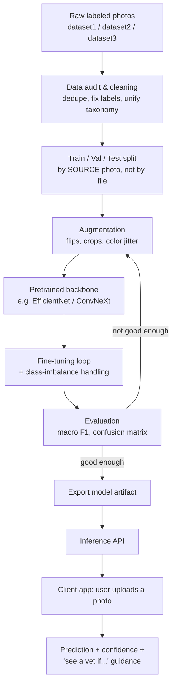

# KNOWLEDGE.md — SkinSense: Understanding the Domain

> This file teaches the subject matter behind SkinSense from scratch. It covers two domains that
> have to meet for this project to work: **veterinary dermatology** (what the pictures mean) and
> **applied computer vision / deep learning** (how a model learns to read them). Update this file
> any time a question reveals a gap — treat it as a living textbook, not a one-time brain dump.

---

## 1. What is this project, in one paragraph?

SkinSense classifies photographs of a dog's skin into a disease category (e.g. fungal infection,
bacterial infection, mange, allergic dermatitis) or "healthy," using a machine-learning image
classifier. It sits at the intersection of **veterinary dermatology** (the medical domain that
defines what the categories even mean and how reliable a photo-only diagnosis can be) and
**computer vision** (the engineering domain that turns pixels into a predicted label).

> ASSUMPTION: SkinSense is meant as a **triage / first-look aid** for pet owners, not a
> replacement for veterinary diagnosis. Everything below (scope, risk framing, UX language)
> is written under that assumption. If the real goal is a clinical decision-support tool for
> vets, or a research/portfolio project with no real users, several sections below should change.

---

## 2. Why this domain exists

**Veterinary dermatology** exists because skin disease is one of the single most common reasons
dogs are brought to a vet — estimates in general practice put skin-related visits at roughly
20–25% of all consultations. Skin is also a visible "check engine light" for problems that
aren't primarily skin problems at all (e.g. food allergies, thyroid disease, immune disorders
often show up on the skin first). Diagnosis is historically hard because many different diseases
*look* similar to a non-expert, and even specialists often need more than a photo (skin scrapings,
cytology, biopsy, response to treatment) to be sure.

**Applied ML for image classification** exists because, for a well-defined set of visually
distinct categories with enough labeled examples, a convolutional/transformer neural network can
learn to approximate the pattern-matching a human expert does — not perfectly, and not as a
substitute for expertise, but well enough to be useful as a fast, cheap, always-available first
pass. This is the same idea behind skin-cancer classifiers in human dermatology (see §8).

The product idea (SkinSense) exists because there's a gap between "owner notices something odd on
their dog's skin" and "owner can get it looked at by a vet" — that gap is filled today with worried
Googling of symptoms. A model that says "this looks most like X, here's my confidence, here's what
to do next" is a better first step than an unstructured search.

---

## 3. Core concepts & terminology

### 3.1 Veterinary dermatology terms (plain language)

| Term | Plain-language definition |
|---|---|
| **Dermatosis** | Umbrella term for "something wrong with the skin." Very broad — a diagnosis label of "dermatosis" alone doesn't say *what* is wrong, just that the skin is abnormal. |
| **Dermatitis** | Inflammation of the skin (redness, swelling, itch, heat). A *symptom pattern*, not a single cause — allergies, irritants, infections, and parasites can all cause dermatitis. Important: "Dermatitis" and "Hypersensitivity" are not strictly synonyms — dermatitis is the visible inflammation, hypersensitivity/allergy is one possible *cause* of it. |
| **Hypersensitivity (allergic) dermatosis** | Skin inflammation caused specifically by an overactive immune response — to food, fleas, or environmental allergens (pollen, dust mites → "atopic dermatitis"). |
| **Bacterial dermatosis (pyoderma)** | Bacterial skin infection, usually secondary to another problem (allergies, parasites, or a wound) that broke down the skin's normal defenses. Often shows pustules, crusts, or a "moth-eaten" hair-loss pattern. |
| **Fungal infection (dermatophytosis / "ringworm")** | Skin infection caused by fungi that digest keratin. **"Ringworm" is a fungal infection — it's not a worm.** Classic look: circular, scaly, hair-loss patches. This is important: some datasets label "ringworm" and "fungal infection" as if they were different, unrelated categories, when dermatologically ringworm *is* a subtype of fungal infection (see gotcha in §5). |
| **Demodicosis (mange)** | Caused by *Demodex* mites that live in hair follicles. Not usually itchy in the localized form; the generalized form can cause widespread hair loss, redness, and secondary infection. A parasitic disease, not fungal or bacterial. |
| **Seborrhea** | Abnormal flaking/oiliness of the skin; can be primary (genetic) or secondary to another skin disease. |
| **Hot spot (acute moist dermatitis)** | A fast-developing, self-inflicted, oozing lesion from a dog licking/chewing/scratching one area raw — often triggered by an underlying itch (allergy, parasite, pain). |
| **Pruritus** | The medical word for "itch." A major clinical sign vets use that a photo alone cannot capture. |
| **Secondary infection** | An infection that develops *because* the skin barrier was already broken by something else (allergy, mange, a wound). This is why real cases are often multiple diseases layered together, not a single clean label. |

**Mental model:** think of the "true" cause of a skin condition as sitting behind a curtain, and the
visible photo as a symptom expressed through that curtain. Several different underlying diseases
can produce a similar-looking symptom (redness, hair loss, scabs), and one underlying disease can
produce very different-looking photos depending on stage, breed, and body location. This is *why*
photo-only classification is fundamentally harder than, say, classifying photos of cats vs. dogs.

### 3.2 Machine learning / computer vision terms (plain language)

| Term | Plain-language definition |
|---|---|
| **Image classification** | Given one image, output one label from a fixed set of categories (here: the disease classes). |
| **CNN (Convolutional Neural Network)** | A neural network architecture built around small filters that slide over the image detecting patterns (edges → textures → shapes → objects), stacked in layers. The standard tool for image classification before and alongside transformers. |
| **Backbone** | The part of the network that turns an image into a compact numeric "feature vector" — usually a pretrained CNN or Vision Transformer (ViT) such as ResNet, EfficientNet, or ConvNeXt. |
| **Classification head** | The small final layer(s) on top of the backbone that turn the feature vector into class probabilities (usually a linear layer + softmax). |
| **Transfer learning** | Instead of training a network from scratch (needs millions of images), start from a network already trained on a huge generic dataset (ImageNet) and *fine-tune* it on your small, specific dataset. This is essential here because a few thousand vet-dermatology photos is far too little to train a CNN from zero. |
| **Fine-tuning** | The process of continuing to train a pretrained model's weights (all or some layers) on your own data, usually with a much smaller learning rate than training from scratch. |
| **Data augmentation** | Artificially expanding a training set by applying random transformations (flips, rotation, crop, color jitter, brightness) to existing images, so the model doesn't just memorize exact pixels. Filenames like `Bacterial_1_png.rf.xxxxx.jpg` in `dataset1` are Roboflow-generated augmented copies of the same source photo (see gotcha in §5). |
| **Train / validation / test split** | Train = data the model learns from. Validation = held-out data used to tune choices (which model, when to stop) without touching the test set. Test = touched exactly once, at the end, to report an honest final score. `datatset2` already ships with this three-way split. |
| **Class imbalance** | When some categories have far more examples than others. This dataset has it badly: `Bacterial_dermatosis` has ~97 images total vs. `ringworm` at ~1,118 — an ~11x gap. A naive model can get deceptively high accuracy by just guessing the majority class. |
| **Overfitting** | The model memorizes quirks of the training images (backgrounds, watermarks, a specific dog's fur) instead of learning the general visual signature of the disease, so it performs well on training data but poorly on new photos. |
| **Confusion matrix** | A table showing, for every true class, what the model actually predicted — reveals *which* classes get mixed up with each other (e.g., is "fungal" being confused with "bacterial"?). |
| **Precision / Recall / F1** | Precision: of everything the model called "fungal," how much really was fungal? Recall: of everything that really was fungal, how much did the model catch? F1 is the balance of the two. For imbalanced, medically-flavored classification, these matter far more than raw accuracy. |
| **Macro-averaging** | Computing a metric (like F1) separately per class and then averaging the per-class scores unweighted — this stops big classes from hiding how badly the model does on small classes. Essential given the imbalance here. |
| **Softmax / confidence score** | The model's raw output is a probability distribution over classes; the highest one is the prediction, and its value is often shown to users as a "confidence" — though it is *not* the same as real-world correctness probability unless the model is calibrated (see §5). |
| **Grad-CAM / saliency maps** | A technique to visualize *which pixels* of the image most influenced the model's decision — useful both for debugging (is it looking at the lesion, or the background?) and for user trust ("here's what looked abnormal"). |
| **Data leakage** | When information from the test set accidentally influences training — e.g. if two augmented copies of the *same* source photo end up split across train and test, the "test" score is inflated and lies about real-world performance. |

---

## 4. How the pieces fit together

**Analogy:** training this model is like teaching a new veterinary student purely from a stack of
labeled photographs, with no ability to touch the dog, ask about itchiness, or run a lab test. The
student (model) will get decent at pattern-matching what's visually distinctive, but will always be
missing context a real exam provides — which is exactly why the product framing must treat the
output as a *hint*, not a diagnosis.

---

## 5. Prerequisites — what to understand before building

1. **Python basics** — the ML tooling (PyTorch/TensorFlow, data loaders, training loops) assumes
   comfort with Python, virtual environments, and basic scripting.
2. **What a neural network is, at a conceptual level** — inputs → weighted layers → output;
   trained by comparing predictions to correct answers and nudging weights (gradient descent /
   backpropagation). You don't need the calculus to start, but you do need the mental model.
3. **Basic statistics** — probability, what a percentage/confidence score means, and especially
   precision/recall/F1 — accuracy alone will actively mislead you on this dataset.
4. **Images as data** — an image is a grid of pixels, each with (typically) 3 color channels
   (R, G, B); resolution, aspect ratio, and color normalization all affect model input.
5. **A little veterinary skin-disease literacy** (§3.1 above) — you need to know what the labels
   *mean* well enough to judge whether the dataset's labeling makes clinical sense, since you
   won't always have a vet double-checking every folder.

---

## 6. Common pitfalls, misconceptions, and gotchas

> ASSUMPTION-flagged items below are inferences from looking at your actual folders, not
> guaranteed facts about the data's origin — verify before relying on them.

- **"Ringworm" and "Fungal infection" may be the same disease labeled as different classes.**
  In `datatset2`/`dataset3`, `ringworm` and `Fungal_infections` are separate class folders, but
  dermatologically ringworm *is* a fungal infection (dermatophytosis). Training a model to tell
  them apart as distinct categories may be training it to memorize incidental differences (photo
  source, lesion stage) rather than a real biological distinction.
  > ASSUMPTION: this split reflects "ringworm = the classic circular scaly presentation" vs.
  > "fungal_infections = other/less classic fungal presentations" in the source dataset, but this
  > needs confirming (or a vet's input) before treating it as ground truth.

- **"Dermatitis" and "Hypersensitivity" are also not guaranteed synonyms**, even though `datatset2`
  keeps them as separate classes here that look plausibly related to `dataset1`'s
  `Hypersensitivity_allergic_dermatosis`. Dermatitis is a broader symptom category than allergy
  specifically — merging or separating these classes is a modeling *decision*, not a fact, and is
  logged as a pending decision in [PROJECT.md](PROJECT.md).

- **Class imbalance is severe and inconsistent across datasets.** Per-class counts observed:
  `Bacterial_dermatosis` ≈ 97, `Hypersensitivity_allergic_dermatosis` ≈ 90 (both `dataset1`-only),
  vs. `ringworm` ≈ 1,118, `demodicosis` ≈ 862, `Healthy`/`Dermatitis`/`Fungal_infections` in the
  several-hundred-to-800 range (across `datatset2` + `dataset3`). A model trained naively will
  likely be very poor on the small classes. This must be addressed with class weighting,
  oversampling, or targeted data collection — not ignored.

- **The Roboflow-duplication/leakage risk below was not hypothetical — we measured it.** Running a
  combined md5 + Roboflow-stem + perceptual-hash dedup pass (`scripts/prepare_data.py`) across all
  8,639 raw image files in `dataset1`/`datatset2`/`dataset3` found only **2,599 truly distinct
  source photos** — meaning **70% of the raw files were exact or near-duplicates of another file**,
  either literal copies across the three dataset folders or Roboflow-augmented siblings of the same
  source image. Any pipeline that split these datasets into train/test by individual file (which is
  the naive, default thing to do) would have leaked the large majority of "test" images into
  training in disguise, making the reported test accuracy meaningless. Always group-split by
  original source photo, never by file, whenever a dataset shows signs of having gone through an
  augmentation tool.

- **Likely data leakage risk from Roboflow-augmented duplicates (the mechanism behind the finding
  above).** Filenames like
  `Bacterial_1_png.rf.30e6141c....jpg`, `Bacterial_1_png.rf.32ed79a2....jpg`, and
  `Bacterial_1_png.rf.7e301129....jpg` in `dataset1` are Roboflow's naming convention for multiple
  *augmented exports of the same source image* (`.rf.<hash>` = Roboflow export hash). If any
  splitting step assigns these near-duplicates to different splits (some to train, one to test),
  the test score will look better than real-world performance warrants. **Any split must group by
  original source image, not by individual file.**

- **`datatset2` ships pre-split into train/valid/test, but `dataset1` and `dataset3` do not** —
  and they are not obviously deduplicated *against* `datatset2` either. Before using all three
  together, check for overlapping/duplicate source photos across datasets, or the "test set" could
  secretly contain images the model already saw during training.

- **Non-uniform image quality and provenance.** Some files look like clean clinical photos, others
  like scraped stock-photo thumbnails, watermarked web images, or low-res screenshots (e.g. names
  like `hj.jpg`, `zdfg.jpg`, `hqdefault.jpg` in `dataset1/Dogs/Bacterial_dermatosis` suggest a mix
  of manually collected and web-scraped sources). Inconsistent backgrounds/watermarks/compression
  give the model shortcuts to "cheat" on (e.g. learning "stock photos = healthy") instead of
  learning the actual skin pattern — a classic overfitting/shortcut-learning trap.

- **A single photo is medically insufficient**, even for a human vet, for several of these
  conditions — pruritus level, distribution pattern over the whole body, response to treatment,
  and skin scrapings/cytology often matter more than a single snapshot. The product must not imply
  more diagnostic certainty than a photo can support.

- **Confidence scores are not truth.** A softmax output of "92% fungal" does *not* mean "92% chance
  this is really fungal" unless the model has been explicitly calibrated — raw neural network
  confidence is frequently overconfident, especially on out-of-distribution photos (bad lighting,
  wrong body part, non-dog images).
  > **This happened, concretely, in this project.** After training a ConvNeXt-Tiny classifier
  > (see PROJECT.md §6/§9), we measured confidence against actual correctness on the held-out test
  > set. For most classes, higher confidence did mean higher accuracy, as expected. But for
  > `Bacterial_dermatosis` — the class with by far the least training data (73 images) — the
  > opposite happened: predictions made with ≥75% confidence were correct only **21% of the time**
  > (3 out of 14), while `Healthy` and `Demodicosis` predictions at that same confidence level were
  > **100% correct**. The model had learned to guess "Bacterial_dermatosis" *confidently* on images
  > that were actually something else, because it had too few real examples to learn what that
  > class actually looks like. Lesson: confidence calibration should be checked **per class**, not
  > just in aggregate — a model can be well-calibrated overall while being dangerously
  > overconfident on exactly the class you have the least data for.

- **Accuracy is a misleading headline metric here** given the imbalance — always report macro-F1
  and the full confusion matrix, not just overall accuracy.

---

- **A merged class's overall accuracy can hide a huge gap between its pre-merge parts.**
  KNOWLEDGE.md's earlier taxonomy-unification pitfall (§6, D1 in PROJECT.md) worried that merging
  labels might combine visually distinct things. Concretely measuring it (PROJECT.md D11) found
  something more specific and more useful: `ringworm` alone classifies at 94.6% accuracy, but
  merged into `Fungal_infection` alongside the weaker `Fungal_infections` sub-label (45.2%
  accuracy), the combined class reports 78.8% — a number that undersells ringworm and oversells
  the rest. The lesson: whenever you unify labels for modeling convenience, keep the *original*
  label as a column (not just the merged one) so you can always break results back out later — this
  project's `manifest.csv` did that from the start (`raw_label` alongside `unified_label`), which
  is exactly what made this analysis possible without retraining anything.

- **Byte-identical duplicates across datasets can carry *conflicting* labels — and that's a data
  quality bug worth actively hunting for, not just a leakage risk.** The earlier duplication
  finding (above) was framed purely as a train/test leakage risk. Going further and asking *which*
  method matched each duplicate group revealed something else: dozens of `Bacterial_dermatosis`
  images in one dataset were **md5-exact identical files** to images labeled `Dermatitis` in
  another dataset — the same photograph, two different disease labels, depending on which source
  dataset you asked. Manually opening a sample of these (this is possible because Claude can view
  images directly, not just read metadata about them) confirmed several were mislabeled: filenames
  like `food_allergy_dermatitis` and `contact_dermatitis` — neither a bacterial condition — turned
  up inside the "Bacterial_dermatosis" folder, apparently from a scraped gallery of general skin
  conditions that got bulk-labeled under the wrong bucket. Lesson: when three datasets are merged,
  always check whether any of them **disagree about the same underlying photo**, not just whether
  they contain duplicates — exact-hash collisions across differently-labeled folders are a strong,
  cheap signal of a labeling error, and are worth eyeballing even when the overall duplicate count
  looks like "just" a leakage-prevention statistic.

- **Removing a poisoned class can improve the remaining classifier more than adding model
  complexity.** In this project, deleting `Bacterial_dermatosis` from the output head raised
  accuracy from 80.6% to 90.7% before any focal-loss improvement. Allergic-dermatitis recall rose
  from 0.644 to 0.839 because the contaminated bacterial class stopped acting as a wrong-answer
  sink. A class can hurt its neighbors when its examples are scarce, contradictory, or mislabeled;
  the correct response may be abstention/exclusion rather than more weighting or a larger network.

- **Focal loss emphasizes hard examples; it is an experiment, not an automatic imbalance cure.**
  After bacterial exclusion, weighted and unweighted cross-entropy tied at about 0.914 macro-F1,
  while focal loss reached 0.931. It improved Allergic, Fungal, and Healthy F1 but slightly reduced
  Demodicosis F1. This is why loss functions must be compared per class, not selected from theory
  alone. The winning focal checkpoint is `models/convnext_4class_focal/best.pt`.

- **More epochs and more pixels can both hurt held-out generalization.** A genuinely uncapped run
  peaked on validation at epoch 24 and stopped at epoch 31, yet scored 0.927 test macro-F1 versus
  0.931 for the 18-epoch checkpoint. Likewise, 384px input fell to 0.895 macro-F1 versus 0.914 for
  the comparable 224px weighted model. Validation selection, resolution, and compute are not
  monotonic proxies for real-world quality; always preserve an untouched test comparison.

- **Simple quality gates are useful for malformed images but weak for semantic OOD detection.**
  Size, aspect-ratio, blank-image, and blur checks rejected 40/55 constructed bad inputs, but also
  rejected 3/15 valid inputs. A nearest-centroid embedding detector caught 0/10 synthetic-noise
  images, and the classifier assigned those invalid images max-softmax scores of 0.852-0.921.
  Therefore, max softmax and simple embedding distance must not be described as proof that the
  upload contains dog skin. A useful semantic gate needs representative negatives (cats, people,
  furniture, screenshots, non-skin dog photos) and a separately evaluated detector.

- **Grad-CAM explains model attention, not disease biology.** A heatmap shows which spatial regions
  most affected a class logit. It can reveal background shortcuts or whether the model looked near
  the lesion, but it is not a segmentation mask, causal explanation, or veterinary diagnosis.
  SkinSense returns it with an explicit disclaimer and does not generate one for rejected images.

- **Manual dedup review should oversample the riskiest matching method.** Exact md5 matches cannot
  be different bytes, whereas perceptual hashes can theoretically collide on visually similar but
  distinct images. A 50-group review therefore included every available phash-only sample (10),
  plus Roboflow, md5, and overlap groups. All 50 were the same underlying photo after transforms;
  the sampled false-positive dedup rate was 0%, including 30 bacterial-touching groups. This
  supports the current threshold but does not replace re-auditing if that threshold changes.

- **For tiny classes, report both fold spread and pooled counts.** Five repeated splits moved
  Bacterial_dermatosis F1 between 0.092 and 0.140 (mean 0.106 +/- 0.018), proving the original
  single-split F1=0.061 was not a stable point estimate. High-confidence bacterial accuracy ranged
  from 9.7% to 66.7%, but the 66.7% fold contained only three predictions. Pooling correct/total
  counts across folds gave 21/87 = 24.1%, close to the original 3/14 = 21.4%. An unweighted mean of
  fold percentages (37.9%) overstates performance because a three-example fold counts as much as a
  39-example fold. Always publish support, per-fold values, mean +/- std, and pooled counts.

## 7. Current state of the art & key tools

**Methodology.** The dominant approach for a dataset this size (thousands, not millions, of
images) is **transfer learning from an ImageNet-pretrained backbone**, fine-tuned on the target
classes — not training a CNN from scratch. Common strong backbone choices in 2024–2026:
`EfficientNetV2`, `ConvNeXt`, and Vision Transformer variants (`ViT`, `DeiT`), all easily available
pretrained through the `timm` library. For resource-constrained deployment (e.g. mobile),
`MobileNetV3` or `EfficientNet-Lite` are the standard efficient choices.

**Human dermatology precedent** (methodologically the closest published analog, even though it's a
different species and disease set): Esteva et al., *"Dermatologist-level classification of skin
cancer with deep neural networks"*, Nature, 2017 — established that transfer-learned CNNs can match
specialist-level performance on photographic skin lesion classification, and also established the
now-standard caveats around dataset bias, calibration, and clinical-deployment risk that this
project should take seriously.

**Veterinary-specific AI dermatology** is a much younger, thinner research area than human
dermatology AI — expect fewer public benchmark datasets, fewer published architectures tuned
specifically for animal skin, and more reliance on adapting human-dermatology or general
fine-grained image classification techniques.

**A dataset listing is not necessarily a new dataset.** Veterinary image collections are often
reposted across Kaggle, Hugging Face, Roboflow, and student repositories under different titles
and licenses. Class counts, filenames, exact hashes, perceptual hashes, and case provenance must
all be checked before merging. In the current audit, a nominally new 3,882-image Hugging Face
collection matched `dataset3` exactly by all six class counts and filename convention, contributing
zero new cases. Treating such a mirror as independent data would be pseudoreplication: the model
sees the same cases more often and the reported score can rise while real generalization does not.

> ASSUMPTION: matching class counts and filenames establishes that the Hugging Face collection is
> a mirror of `dataset3`; byte-level confirmation requires downloading its 207 MB image archive,
> which is unnecessary for training because even a non-identical re-encoding would represent the
> same named source cases.

**A larger backbone can generalize worse on a noisy small dataset.** In a controlled experiment,
ConvNeXt-Small with ImageNet-12K pretraining reached 0.9326 validation macro-F1 but only 0.8739 on
the untouched test set, below the smaller shipped model's 0.9310. More parameters do not repair
inconsistent labels or dataset-source shortcuts; validation selection can also overfit a single
split. Capacity increases must therefore earn their place on the untouched test set.

**Key libraries/tools:**
- `PyTorch` (training/modeling) and `torchvision` (image transforms/augmentation)
- `timm` ("PyTorch Image Models") — huge zoo of pretrained backbones, one-line fine-tuning setup
- `TensorFlow` / `Keras` — alternative to PyTorch, has a well-documented transfer-learning guide
- `albumentations` — fast, rich image augmentation library, popular for medical/vet imaging
- `scikit-learn` — for confusion matrices, classification reports, metric computation
- `Grad-CAM` implementations (e.g. `pytorch-grad-cam`) — for explainability
- `FastAPI` — common choice for wrapping a trained model in an inference API
- `Roboflow` — the tool that apparently produced part of `dataset1` (evidenced by `.rf.<hash>`
  filenames) — useful for dataset versioning/augmentation/export if you continue using it

---

## 8. Further reading

- Esteva, A. et al. (2017). *Dermatologist-level classification of skin cancer with deep neural
  networks.* Nature 542, 115–118. https://www.nature.com/articles/nature21056
- PyTorch official transfer learning tutorial:
  https://pytorch.org/tutorials/beginner/transfer_learning_tutorial.html
- `timm` documentation (pretrained model zoo & fine-tuning): https://huggingface.co/docs/timm
- Keras transfer learning & fine-tuning guide: https://keras.io/guides/transfer_learning/
- `albumentations` documentation: https://albumentations.ai/docs/
- Roboflow documentation (dataset versioning/export, relevant since `dataset1` was processed
  through it): https://docs.roboflow.com/
- Merck Veterinary Manual — Dermatology section (accessible overview of canine skin diseases,
  useful for sanity-checking class definitions): https://www.merckvetmanual.com/dog-owners
- Miller, W., Griffin, C., Campbell, K. — *Muller and Kirk's Small Animal Dermatology* (the
  standard veterinary dermatology reference textbook, worth having access to if you want authoritative
  definitions for each disease class).

---

## Changelog

- **2026-08-22** — Initial version, written from an audit of `dataset1/`, `datatset2/`, and
  `dataset3/` (no code existed yet). Flagged taxonomy overlaps (ringworm/fungal, dermatitis/
  hypersensitivity), class imbalance, and likely Roboflow-augmentation leakage risk as open items.
- **2026-08-22 (later same day)** — Added two real, measured findings from actually training
  models: (1) the Roboflow-duplication leakage risk was confirmed — 70% of raw files were
  duplicates/augmentation-siblings; (2) per-class confidence calibration can fail even when overall
  calibration looks fine — `Bacterial_dermatosis` was 21% accurate at high confidence due to
  extreme data scarcity (73 training images), while other classes were near-perfectly calibrated.
  See PROJECT.md §6 (decisions D6, D7) and §9 for the full results this was drawn from.
