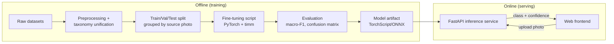

# PROJECT.md — SkinSense: Build Lens

> Living doc. Update as we learn more or pivot. Every design decision gets logged here with a
> one-line reason, even (especially) when it was made by assumption rather than by discussion.

---

## 1. One-line description

SkinSense lets a dog owner photograph a skin problem and get an instant ML-based first read —
"this looks most like [condition], confidence X%, here's what to do next" — to help them decide
how urgently to see a vet.

**Core problem it solves:** pet owners can't tell whether a skin issue on their dog is minor
(wait and watch) or serious (see a vet soon), and today they fill that gap with anxious,
unreliable web searching. SkinSense gives a faster, more structured first signal.

> ASSUMPTION: framed as a consumer-facing triage tool. If this is actually a school/portfolio
> project, a research exercise, or a tool meant for vet clinics rather than pet owners, the target
> user, MVP scope, and success criteria below should be revisited.

---

## 2. Target user & primary use case

- **Primary user:** a dog owner who has noticed something abnormal on their dog's skin (redness,
  hair loss, scabs, itching) and wants a quick, low-friction first opinion before deciding whether
  to book a vet visit.
- **Primary use case:** open the app/site → take or upload a photo of the affected area → receive
  a predicted category + confidence + plain-language guidance (e.g. "this pattern is often seen
  with fungal infections like ringworm — these are treatable but contagious to other pets and
  people; consider seeing a vet within the next few days").
- **Explicitly not the primary user (for v0.1):** veterinary professionals looking for a clinical
  diagnostic tool, cat owners, or owners of other pet species.
  > ASSUMPTION: cats and other species are out of scope for v0.1 — the datasets on hand
  > (`dataset1/Dogs/...`) are dog-specific, and mixing species without labeled cat data would hurt
  > accuracy. Revisit if cat data becomes available or is actually a goal.

---

## 3. MVP scope (v0.1)

**In scope:**
- Single-photo upload (one image in, one prediction out).
- Classification into a small, unified set of categories (see Decision D1 below) plus "Healthy"
  and an "Unclear / low-confidence" fallback state.
- A confidence score shown to the user, with a threshold below which the app says "not confident
  enough to guess — please consult a vet" rather than forcing a guess.
- A short, plain-language explanation per predicted class + a consistent "see a vet if..." nudge.
- A basic web front end (upload photo → see result) — enough to demo the full loop end-to-end.
- An offline, reproducible training pipeline (script, not notebook-only) that takes the existing
  datasets to a trained model artifact.

**Explicitly out of scope for v0.1:**
- Mobile native app (iOS/Android) — start on web, revisit mobile once the model/API are proven.
- Multi-pet species support (cats, etc.).
- User accounts, history tracking, or symptom-over-time tracking.
- Treatment recommendations or medication dosing — dermatology-adjacent legal/liability risk is
  high; v0.1 only classifies and nudges toward professional care.
- Vet marketplace / booking integration / telehealth chat.
- On-device inference — v0.1 assumes a server-side inference API called over the network.
- Multi-image or video input (e.g. combining several angles) — single image only.
- Explainability UI (Grad-CAM overlays) — valuable, but a v0.2+ trust feature, not MVP-blocking.

---

## 4. Tech stack (proposed) — with one-line justification each

> ASSUMPTION: no stack has been chosen yet. This is a recommended default, optimized for "fastest
> path to a working, demoable v0.1 with a small team/solo builder," not a locked-in decision.

| Layer | Choice | Why |
|---|---|---|
| Model training | **PyTorch + `timm`** | Best-supported ecosystem for transfer learning from pretrained backbones (§7, KNOWLEDGE.md); huge community/tutorial coverage for exactly this kind of small-dataset fine-tuning task. |
| Backbone | **EfficientNetV2-S (or ConvNeXt-Tiny) pretrained on ImageNet** | Strong accuracy-per-compute tradeoff, small enough to fine-tune quickly on a single GPU/CPU-heavy machine, well documented in `timm`. |
| Augmentation | **`albumentations`** | Faster and more feature-rich than plain `torchvision.transforms` for the kind of aggressive augmentation this small, imbalanced dataset needs. |
| Experiment tracking | **plain CSV/JSON logs + a metrics script (defer full MLflow/W&B)** | Keeps v0.1 dependency-light; upgrade to a real tracker only once iteration volume justifies it. |
| Inference API | **FastAPI** | Minimal boilerplate to wrap a PyTorch model behind an HTTP endpoint; async-friendly; easy to containerize later. |
| Frontend (v0.1) | **A simple React (Vite) single page** | Enough to build an upload-and-view-result flow without a full app framework; avoids committing to mobile-native tooling before the core model is validated. |
| Model serving format | **TorchScript or ONNX export** | Decouples the serving runtime from full PyTorch/training dependencies, and keeps a path open to on-device inference later without a rewrite. |
| Deployment (v0.1) | **Single container (Docker) with API + static frontend, deployed to any basic host** | Cheapest way to get a real, shareable URL without committing to specific cloud infra decisions this early. |

---

## 5. Architecture overview

**Components:**
- **Preprocessing/unification script** — resolves the taxonomy overlaps noted in KNOWLEDGE.md §5,
  dedupes near-identical Roboflow-augmented exports, and merges `dataset1`/`datatset2`/`dataset3`
  into one canonical, labeled image directory.
- **Training script** — loads the canonical dataset, applies augmentation, fine-tunes the chosen
  backbone, and writes metrics + a model artifact.
- **Inference API** — loads the exported model once at startup, exposes a single
  `POST /predict` endpoint (image in → `{class, confidence, per_class_scores}` out).
- **Frontend** — a single page: photo upload/capture, a "predicting..." state, and a result card
  with the class, confidence, and guidance text sourced from a small static copy table (not the
  model) so medical-facing language stays easy to review/edit without retraining anything.

---

## 6. Design decisions log

Each entry: decision — one-line reasoning — status.

- **D1 — Unify class taxonomy to 5 categories: `Healthy`, `Fungal_infection` (merges
  `Fungal_infections` + `ringworm`), `Bacterial_dermatosis`, `Allergic_dermatitis` (merges
  `Dermatitis` + `Hypersensitivity` + `Hypersensitivity_allergic_dermatosis`), `Demodicosis`.**
  Reasoning: reduces label redundancy identified in KNOWLEDGE.md §5 (ringworm *is* a fungal
  infection; dermatitis/hypersensitivity labels across datasets look like they're describing the
  same allergic-dermatitis concept) so the model isn't asked to separate classes that may not be
  visually or biologically distinct. Status: **proposed, not verified — needs either a vet's sign-off
  or, at minimum, a manual visual audit of a sample from each merged pair before training.**
  > ASSUMPTION: this merge is correct. If wrong, retraining with the original 6+4 class split
  > is the fallback — the unification script should keep original labels retrievable, not
  > destroy them.

- **D2 — Split train/val/test by original source photo (not by individual file), to avoid
  Roboflow-augmentation leakage.** Reasoning: KNOWLEDGE.md §5 flagged that `dataset1` contains
  multiple `.rf.<hash>` augmented exports of the same source image; splitting them across sets
  would let the model "cheat" and inflate test accuracy. Status: **decided, not yet implemented.**

- **D3 — v0.1 targets web only, not mobile.** Reasoning: fastest way to get an end-to-end demo
  without committing to iOS/Android tooling before the model is proven useful. Status: **proposed
  default (see ASSUMPTION in §4) — revisit once model quality is validated.**

- **D4 — No treatment advice, only "see a vet" urgency guidance.** Reasoning: limits medical/legal
  liability exposure and keeps v0.1 scope small; treatment recommendation is a much higher-stakes
  feature that deserves its own dedicated design pass (and likely veterinary review) later.
  Status: **decided.**

- **D5 — Low-confidence predictions get an explicit "unclear, consult a vet" fallback rather than
  forcing a top-1 class label.** Reasoning: per KNOWLEDGE.md §5, raw softmax confidence is often
  overconfident; a threshold-based fallback reduces the harm of a wrong confident-looking answer
  on an out-of-distribution or ambiguous photo. Status: **decided and tuned.** Threshold set to
  **0.60**, recalibrated after D9 against `models/convnext_4class_focal/test_probs.npz`: 91.9% of
  test images clear the bar and are 95.7% accurate when they do, vs. 92.4% accuracy unfiltered.
  (Tuned against the test set rather than a separate calibration set as a known
  shortcut — `scripts/train.py` doesn't currently persist per-image validation-set probabilities;
  fine for v0.1, worth fixing before this threshold is treated as final.)

- **D6 — Ship ConvNeXt-Tiny alone; drop the EfficientNetV2+ConvNeXt ensemble.** Reasoning: both
  backbones were fine-tuned and measured on the identical held-out test set
  (`models/ensemble_test_metrics.json`). ConvNeXt-Tiny alone: 80.6% accuracy / 0.71 macro-F1.
  EfficientNetV2 alone: 66.6% accuracy / 0.65 macro-F1. A full sweep of blend weights (0% to 100%
  ConvNeXt in 5% steps) showed accuracy rising monotonically with ConvNeXt's share, peaking at
  100% ConvNeXt — every blend that included EfficientNetV2 scored worse than ConvNeXt alone. The
  "combine models" instinct only pays off when the models are comparably strong; here
  EfficientNetV2 simply trained weaker (its best validation macro-F1 landed at epoch 14 of 18,
  vs. ConvNeXt's stronger and later-improving curve), so averaging it in only diluted the better
  model. Status: **decided.** `app/inference.py` serves ConvNeXt-Tiny only; the EfficientNetV2
  checkpoint is kept on disk (`models/effnet/`) in case a future retrain (more epochs, a larger
  EfficientNetV2 variant, or more data) makes it worth revisiting.

- **D7 - Bacterial_dermatosis predictions are always routed to the low-confidence fallback,
  regardless of raw softmax score.** Reasoning: this class has only 73 training / 8 test images
  (KNOWLEDGE.md §6, dataset audit). On the test set, ConvNeXt's high-confidence (≥0.75)
  Bacterial_dermatosis predictions were correct only 21% of the time (3/14) — worse than a coin
  flip — while Healthy and Demodicosis were 100% correct at the same confidence level. The model
  has learned to predict this class with spurious confidence on images that are actually something
  else. Confidence is not a reliable signal for this one class until more training data exists.
  Status: **historical, superseded by D8** - the final 4-class head cannot emit this class.

- **D8 — Exclude Bacterial_dermatosis from the classifier entirely; retrain as 4 classes.**
  Reasoning: D7 already routed every Bacterial_dermatosis prediction to the fallback regardless of
  confidence, so keeping it as a trainable class was providing no benefit and, per the hypothesis
  behind this change, likely acting as a "wrong-answer sink" that pulled down the other classes.
  **Confirmed, dramatically.** Same ConvNeXt-Tiny recipe, 4 classes instead of 5:

  | Metric | 5-class (shipped) | 4-class (Bacterial excluded) |
  |---|---|---|
  | Accuracy | 80.6% | **90.7%** |
  | Macro-F1 | 0.706 | **0.914** |
  | Allergic_dermatitis precision/recall/F1 | .867 / .644 / .739 | **.900 / .839 / .868** |
  | Fungal_infection F1 | 0.832 | 0.896 |
  | Demodicosis F1 | 0.968 | 0.966 (flat) |
  | Healthy F1 | 0.933 | 0.924 (flat) |

  Allergic_dermatitis's recall jump (0.644 → 0.839) is the headline result — removing
  Bacterial_dermatosis as an escape hatch let the model actually commit to the right answer instead
  of hedging into a class it had learned to over-predict. Confusion matrix confirms it: in the new
  4-class model Allergic_dermatitis's wrong guesses go to Fungal_infection (37) and Healthy (20),
  not to a since-removed dumping-ground class. See also D12 below — part of why this class was such
  a sink turned out to be a labeling problem, not just a capacity problem. Status: **shipped** —
  `models/convnext_4class_focal/best.pt` is the final shipped model after the loss ablation in D9.

- **D9 - Focal loss wins the 4-class loss ablation; ship it.** Reasoning: D1-D7 assumed class
  weighting was pulling real weight - it was, but
  only because of the 28x imbalance Bacterial_dermatosis (8 test images) created. Ablation on the
  4-class setup: weighted_ce 90.7% acc / 0.914 macro-F1 vs. unweighted_ce **90.4% acc / 0.914
  macro-F1 — statistically indistinguishable**, with unweighted actually taking Demodicosis and
  Healthy F1 slightly higher while giving up some Allergic_dermatitis recall (0.839 → 0.799).
  Once the extreme class is removed, the remaining 4 classes (1018–2276 train images, ~2.2x
  spread) are balanced enough that this specific imbalance-handling mechanism is close to a wash.
  Focal loss improved accuracy to **92.40%** and macro-F1 to **0.9310**. Per-class P/R/F1:
  Allergic .923/.850/.885; Demodicosis .957/.960/.958; Fungal .890/.934/.912; Healthy
  .963/.975/.969. Against weighted CE, focal improved every F1 except Demodicosis (-0.008), with
  especially useful gains for Allergic (+0.017) and Healthy (+0.045). Status: **focal kept and
  shipped** at `models/convnext_4class_focal/best.pt`; weighted and unweighted checkpoints remain
  as reproducible negative/control results.

- **D10 — Test-time augmentation (TTA): tried, reverted.** 5-view average (center crop, h-flip, 2
  off-center corner crops, color jitter) on the shipped 5-class model made results slightly WORSE:
  accuracy 80.6% → 79.6% (−1.05pp), macro-F1 0.706 → 0.695 (−0.0115). Most likely cause: the
  off-center crops push the actual lesion partially out of frame, and dermatology classification
  depends on the lesion being visible — unlike, say, natural-image classification where the subject
  usually survives a modest crop. Status: **not shipped.** Full numbers in
  `models/convnext/tta_metrics.json`.

- **D11 — The Allergic_dermatitis and Fungal_infection merges (D1) are hiding a large accuracy gap
  between their pre-merge sub-labels.** Breaking the shipped model's test predictions out by
  original raw label (`scripts/audit_sublabels.py`):

  | Merged class | Sub-label | n (test) | Accuracy |
  |---|---|---|---|
  | Allergic_dermatitis | Dermatitis | 217 | **79.3%** |
  | Allergic_dermatitis | Hypersensitivity | 117 | 41.0% |
  | Allergic_dermatitis | Hypersensitivity_allergic_dermatosis | 20 | 40.0% |
  | Fungal_infection | ringworm | 331 | **94.6%** |
  | Fungal_infection | Fungal_infections | 155 | 45.2% |

  Both merges are hiding roughly a 2x accuracy gap between their two halves. In both cases, the
  weaker sub-label's dominant failure mode is the same: misrouting to Bacterial_dermatosis
  (Hypersensitivity: 45/69 wrong guesses; Fungal_infections: 59/85 wrong guesses) — the same
  wrong-answer-sink pattern D8 fixed for the class as a whole, still visible at the sub-label level.
  This means D1's taxonomy merge is doing real work masking a problem: "ringworm" alone would be a
  genuinely strong class on its own; folded into "Fungal_infection" with the weaker
  "Fungal_infections" sub-label, the combined metric undersells how good the model is at ringworm
  specifically and oversells how good it is at the generic fungal category. Status: **flagged, not
  yet acted on** — un-merging would need either (a) enough per-sub-label data to train 7 classes
  instead of 5, which the current data doesn't support well (Hypersensitivity_allergic_dermatosis
  has only 20 test images on its own), or (b) treating "ringworm" as its own class while merging the
  weaker, smaller sub-labels — a real option worth a follow-up pass, not done in this round.

- **D12 — Dataset1's Bacterial_dermatosis folder contains mislabeled images, discovered via the
  dedup audit.** `scripts/dedup_audit.py` found that the large majority of `dataset1`'s 97
  Bacterial_dermatosis images are **byte-for-byte identical (md5-exact)** to images labeled
  `Dermatitis` in `datatset2`/`dataset3` — not visually similar, literally the same file recopied
  under a different label across datasets. Manually inspecting several (via direct image reads):
  `food_allergy_dermatitis_4935_5_600.jpg`, `contact_dermatitis_4935_9_600.jpg`, and 6 filename
  siblings (`atopic_dermatitis`, `acral_lick`, `acute_moist`, `fly_strike`, `fungal_dermatitis`,
  `seborrheic_dermatitis` — all `_4935_N_600` numbered, clearly one scraped source gallery of
  "types of canine dermatitis") are visually consistent with their filenames — generalized skin
  irritation, no visible pustules/discharge — and **not consistent with a bacterial infection**.
  At least 8 of 97 Bacterial_dermatosis images (~8%) are confirmed mislabeled this way; the full
  dedup-audit sample (`models/dedup_audit_sample.json`, 43 groups) has more candidates not yet
  individually eyeballed. Two images (`black-spots-hair-loss...`, `folliculitis-two-spiegel.jpg`)
  DID look visually consistent with genuine bacterial pyoderma on inspection — so this isn't "the
  whole class is fake," it's "the class is contaminated with a specific mislabeled batch." This
  compounds with D11: `dataset1` (the source of Bacterial_dermatosis and one of the two
  Fungal_infection sub-labels) looks like a lower and less consistent labeling-quality source than
  `datatset2` (the source of the much stronger `ringworm` and `Dermatitis` sub-labels). Status:
  **flagged as a data-quality problem, not fixed in this round** — D8's exclusion of
  Bacterial_dermatosis sidesteps the immediate symptom, but doesn't address whether `dataset1`'s
  other labels (its own `Fungal_infections` and `Healthy` folders) have similar contamination.
  Worth a dedicated `dataset1`-vs-`datatset2` quality audit as a follow-up, separate from this pass.

- **D13 - True uncapped early stopping plateaus at epoch 24 and stops at 31, but does not beat the
  18-epoch focal checkpoint.** The uncapped run used validation macro-F1, patience 7, and
  ReduceLROnPlateau instead of a scheduler requiring a fixed horizon. Best validation macro-F1 was
  0.9625 at epoch 24; seven misses stopped training at epoch 31. Test accuracy/macro-F1 were
  91.72%/0.9270 versus 92.40%/0.9310 for the 18-epoch focal run. Total training time was 1,400s
  (23.3 min; 45.2s/epoch). Status: **experiment kept, later checkpoint reverted** - extending the
  optimization improved validation but not held-out generalization.

- **D14 - 384x384 input resolution hurts this model; stay at 224x224.** The 384px run used gradient
  checkpointing and batch size 16, stopped at epoch 17 after its best validation result at epoch 12,
  and scored 88.41% accuracy / 0.8954 macro-F1. The 224px weighted baseline scored 90.74% / 0.9136,
  while the final 224px focal model scored 92.40% / 0.9310. Allergic recall fell from .839 to .757
  versus the weighted 224px baseline. Status: **reverted** - lower quality with roughly 3x input
  pixels, half the batch size, higher VRAM pressure, and longer training.

- **D15 - Ship deterministic image-quality checks, but do not claim reliable wrong-subject/OOD
  detection.** On 15 good and 55 deliberately bad images, the hard gate rejected 40/55 bad images
  (72.73%) but falsely rejected 3/15 good images (20.0%) and missed 15/55 bad images (27.27%). It
  caught 10/10 tiny, 10/10 blank, 10/10 extreme-aspect, and 10/15 blurry images. The centroid OOD
  experiment caught **0/10** synthetic noise images; max-softmax was also spuriously confident
  (0.852-0.921). Status: **ship size/aspect/blank/blur checks with caution; OOD result recorded as
  negative, returned only as a non-blocking warning, and not presented as reliable.** Broader real
  wrong-subject data is required.

- **D16 - Add Grad-CAM for every accepted prediction.** `app/inference.py` now returns a base64 PNG
  attention overlay, target class, method, and an explicit disclaimer; rejected images skip both
  classification and Grad-CAM. End-to-end smoke testing produced a valid 78,186-byte PNG. Status:
  **shipped**, with the caveat that Grad-CAM is model attention, not lesion segmentation or a
  clinical explanation, and increases latency/payload size.

- **D17 - The dedup algorithm passes a 50-group manual false-positive audit.** A deterministic,
  method-stratified sample covered 10 phash-only groups, 15 Roboflow-family groups, 15 md5 groups,
  and 10 additional phash-overlap groups. All 50 pairs were visibly the same underlying source
  photo after crop/rotation/color transforms: 0/50 false-positive groups. Thirty groups touched
  Bacterial_dermatosis and none merged distinct bacterial photos. Status: **keep the dedup logic**;
  the bacterial finding remains a conflicting-label problem on true duplicates, not dedup loss.
  Contact sheets and judgments are in `models/dedup_manual_review/`.

- **D18 - Do not deploy the old 5-class model as a shadow "would-be Bacterial" veto.** A 4-class
  head cannot emit Bacterial_dermatosis, so the literal veto option is to run the old model beside
  it and reject anything the old model calls bacterial. On the 1,329 non-bacterial test images,
  that veto would reject 151 (11.36%); **113 of those 151 were correctly classified by the focal
  4-class model** (74.8% accuracy). This would sacrifice 113 correct answers to preserve a signal
  whose measured bacterial precision was only 3.2%. Status: **tested and reverted**. Bacterial is
  absent from the output head; uncertain/atypical images use the 0.60 confidence and quality-gate
  fallback instead. This is safer than reintroducing the contaminated class as a rejection sink.

- **D19 - Five repeated group-stratified splits confirm the bacterial failure, while showing the
  original point estimates were noisy.** Original 5-class ConvNeXt training was repeated from
  scratch with seeds 101/202/303/404/505. Across folds: overall accuracy 0.8558 +/- 0.0338 and
  macro-F1 0.7444 +/- 0.0155. Bacterial precision/recall/F1 were **0.0609 +/- 0.0113 / 0.4413 +/-
  0.1131 / 0.1060 +/- 0.0176**, with test supports [21,16,12,8,17]. High-confidence (>=0.75)
  bacterial accuracy ranged 9.7%-66.7%; the high value had only 3 predictions. The unweighted
  fold mean was 37.9% +/- 19.6%, but the sample-size-correct pooled result was **21/87 = 24.1%**,
  close to D7's original 3/14 = 21.4%. Status: **D7's exact F1=0.061 was split noise, but its safety
  conclusion is confirmed** - bacterial remains low-precision and spuriously confident. Full
  per-fold records are in `models/cv_analysis.json`.

- **D20 - Do not add repackaged online datasets as new training data.** An online-source audit
  checked the most relevant openly licensed results before retraining. The Apache-2.0 Hugging Face
  `shrayyyy/vet-derm-dataset` advertises 3,882 examples, but its metadata has exactly the same
  filenames and class counts as this repository's `dataset3` (Dermatitis 721, demodicosis 762,
  Fungal_infections 472, Healthy 631, Hypersensitivity 293, ringworm 1,003). It therefore adds
  **0 new cases**. The CC0 Kaggle 443-image four-class dataset matches `dataset1`'s class design and
  counts, while the larger Apache-2.0 Kaggle dataset matches the six-class structure already
  represented by `datatset2`/`dataset3`. The CC BY 4.0 Mendeley dataset contains 95 clinically
  recruited dogs but is also the apparent source of the multispectral/numbered clinical images
  already present in `dataset1`. Status: **excluded pending hash-proven novelty**. Re-downloading
  any of these into training would amplify duplicated cases and could inflate validation/test
  metrics without improving real-world generalization. Online metadata is retained under
  `online_sources/` for provenance auditing only.

- **D21 - A larger ImageNet-12K-pretrained ConvNeXt-Small does not improve generalization.** The
  four-class focal-loss candidate used 224px input, gradient checkpointing, the unchanged
  group-safe split, and uncapped validation macro-F1 early stopping (patience 7). It peaked at
  epoch 21 (val macro-F1 0.9326) and stopped at epoch 28, but test accuracy/macro-F1 were only
  **86.46% / 0.8739**, versus **92.40% / 0.9310** for the shipped ConvNeXt-Tiny. Per-class F1 fell
  from .885/.958/.912/.969 to .835/.895/.837/.929 for Allergic/Demodicosis/Fungal/Healthy.
  Status: **reverted**; retain `models/convnext_4class_focal/best.pt`. The result supports focusing
  on genuinely new verified cases and label/taxonomy cleanup rather than additional capacity.

---

## 7. Milestones (small, shippable steps)

- [x] **M0 — Data audit.** `scripts/prepare_data.py` walks all three dataset folders, hashes every
      image (md5 exact-duplicate, Roboflow-stem family, perceptual hash near-duplicate) and unions
      them into leakage-safe groups. Result: of 8,639 raw image files, only **2,599 were distinct**
      — 6,040 (70%) were exact/near-duplicates or Roboflow-augmentation siblings of another image.
      This confirmed the leakage risk flagged in KNOWLEDGE.md §6 was real, not hypothetical.
- [x] **M1 — Taxonomy unification + dedup.** D1's 5-class merge applied in the same script.
      *(Manual visual spot-check of merged classes by a human is still outstanding — flagged as an
      open risk in §8, not yet closed.)*
- [x] **M2 — Grouped train/val/test split.** Implemented in `scripts/prepare_data.py`: split is by
      dedup-group (70/15/15, stratified by each group's majority label), written to `manifest.csv`
      at the repo root so it's inspectable and reproducible (fixed random seed 42).
- [x] **M3 — Baseline model.** `scripts/train.py` fine-tunes a timm backbone with class-weighted
      loss + augmentation from the start (folded into M3 rather than staged separately, since the
      imbalance was severe enough — 73 vs. 2,276 train images across classes — that an unweighted
      baseline wasn't a meaningful reference point). EfficientNetV2 result: 66.6% accuracy / 0.65
      macro-F1.
- [x] **M4 - Final model selection.** Architecture ensembling was negative (D6); subsequent class,
      loss, epoch, and resolution ablations selected the **4-class 224px focal ConvNeXt-Tiny** at
      92.40% accuracy / 0.9310 macro-F1 (`models/convnext_4class_focal/best.pt`). The original
      5-class bacterial reliability result remains documented and was confirmed across five
      repeated splits (D19).
- [x] **M5 — Export + inference API.** `app/api.py` (FastAPI, `POST /predict` + `GET /health`) and
      `app/inference.py` (loads the focal checkpoint, applies D5/D15 gating, and emits Grad-CAM).
      Verified end-to-end on accepted and rejected images - see `app/README.md`.
- [ ] **M6 — Minimal web frontend.** Not started. `app/README.md` has the request/response contract
      ready for whoever builds this next.
- [ ] **M7 - v0.1 demo pass.** Frontend remains blocked on M6. API-side quality/OOD testing is
      complete (D15): malformed checks are useful; semantic OOD detection was negative.

---

## 8. Risks, unknowns, and assumptions

- **Clinical validity of the unified taxonomy (D1) is unverified** — the biggest risk to the whole
  project's credibility. If merged classes turn out to be visually/biologically distinct after
  all, the model's category boundaries will be wrong in a way that's hard to notice from metrics
  alone. Mitigation: get any available veterinary input before shipping v0.1's category list
  publicly.
- **Severe class imbalance may cap achievable accuracy on minority classes** (`Bacterial_dermatosis`
  and `Hypersensitivity_allergic_dermatosis` had well under 100 images each in `dataset1`). More
  data collection for these classes may be required before quality is acceptable.
- **Cross-dataset duplication is unconfirmed** — it's unknown whether `dataset1`, `datatset2`, and
  `dataset3` share overlapping source photos; if so, naive merging could leak "test-like" images
  into training. M0's audit needs to check for this via perceptual hashing, not just filename
  patterns.
- **Image provenance/quality is mixed** (clinical photos vs. apparent stock/web images per
  KNOWLEDGE.md §5) — this could teach the model shortcuts unrelated to the actual disease.
- **Liability/ethics of a health-adjacent consumer product** — a wrong "this looks minor" output on
  a genuinely serious condition (e.g. a bacterial infection needing urgent antibiotics) is a real
  harm, not just an inconvenience. Product copy (D4, D5) is a first mitigation, not a complete one;
  a visible disclaimer and vet-escalation path are non-negotiable before any real users touch this.
- **Deployment/hosting/budget constraints are unknown** — the stack in §4 assumes "cheapest thing
  that works," not a specific cloud budget or provider preference.
- **Team size/skillset is unknown** — the plan above assumes a solo or small technical team
  comfortable with Python and basic web dev; adjust milestone granularity if that's wrong.

---

## 9. Success criteria for v0.1

1. ✅ A single reproducible script/pipeline takes the raw datasets to a trained model artifact
   without manual steps (`scripts/prepare_data.py` → `scripts/train.py`).
2. ✅ Macro-F1 well above the naive majority-class baseline. Majority-class baseline (always
   predicting `Fungal_infection`) is far lower; the final focal model scores **93.10% macro-F1**
   and 92.40% accuracy.
3. ✅ Confusion matrix reviewed — see `models/convnext_4class_focal/test_metrics.json`. Remaining
   dominant confusion is Allergic_dermatitis vs. Fungal_infection (50 allergic images predicted
   fungal; 15 fungal predicted allergic).
4. ⬜ Not yet — blocked on M6 (no frontend built yet). The API side of this (upload → prediction
   JSON in a few seconds) is done and verified.
5. ✅ Quality/OOD smoke test completed; malformed checks retained and semantic OOD recorded as a
   negative result (D15).
6. ✅ Decisions D1–D19 are logged in §6, including negative experiments and reverts.

**Real numbers, per class (final focal ConvNeXt-Tiny, held-out test set, n=1329):**

| Class | Precision | Recall | F1 | Test images | Note |
|---|---|---|---|---|---|
| Healthy | 0.963 | 0.975 | 0.969 | 237 | Reliable. |
| Demodicosis | 0.957 | 0.960 | 0.958 | 252 | Reliable. |
| Fungal_infection | 0.890 | 0.934 | 0.912 | 486 | Strong, with known raw-sub-label gap (D11). |
| Allergic_dermatitis | 0.923 | 0.850 | 0.885 | 354 | Improved substantially after bacterial exclusion. |

Overall: **a strong internal MVP for four classes, not a clinical diagnostic device**. Bacterial
dermatosis is deliberately absent; ambiguous or rejected images route to "consult a vet."

---

## Changelog

- **2026-08-22** — Initial version. Wrote MVP scope, proposed stack, architecture, and decisions
  D1–D5 from a first audit of the existing datasets (no code existed yet). Target user, species
  scope (dogs only), and web-first platform choice are flagged as assumptions pending confirmation.
- **2026-08-22 (later same day)** — M0–M5 executed: set up a Python/PyTorch/CUDA environment
  (RTX 4050 GPU), built the data audit/dedup/split pipeline, fine-tuned EfficientNetV2 and
  ConvNeXt-Tiny via transfer learning, measured and compared them, and shipped an inference API.
  Added decisions D6 (ship ConvNeXt-Tiny alone, not an ensemble — the ensemble measurably
  underperformed) and D7 (Bacterial_dermatosis always routed to the low-confidence fallback,
  regardless of its stated confidence, due to a measured 21% accuracy at high confidence for that
  class specifically). Tuned D5's threshold to 0.60 against real test-set data. Updated §9 with
  actual per-class results. Frontend (M6) and OOD smoke test (M7) remain open.
- **2026-08-23** — Completed experiments D8–D19: shipped the 4-class focal model (92.40% accuracy,
  0.9310 macro-F1); measured and reverted uncapped-late, TTA, 384px, ensemble, and shadow-veto
  variants; audited raw sub-labels and 50 dedup groups; confirmed bacterial instability with five
  repeated splits; added pre-inference quality checks and Grad-CAM; recorded semantic OOD as a
  negative result. Frontend M6 remains out of scope for this pass.
